# 2-Phase Message

This article proposes an alternative pattern to OutBox: 2-phase message. It is not based on message queue, but based on [github.com/dtm-labs/dtm](https://github.com/dtm-labs/dtm), a highly available distributed transaction framework.

An inter-bank transfer is a typical distributed transaction scenario, where A needs to transfer money across a bank to B. The balances of A and B are not in the same bank so that they are not stored in a single database. This transfer is typically crossing micro-services also.

The main problem is that the transfer must update two systems simultaneously -- the increment of A' balance and the decrement of B's balance. This is called well-known "dual writes". A process crash between the two updates leaves the entire system in an inconsistent state.

This "dual writes" problem can be solved by OutBox pattern. The principal of OutBox pattern can be found here [Transactional OutBox](https://microservices.io/patterns/data/transactional-outbox.html)

## 2-Phase Message

First let's take a glance at how to accomplish the above transfer task using the new pattern. The following codes is in Go, other languages like C#, PHP can be found here: [dtm SDKs](https://en.dtm.pub/ref/sdk.html)

``` Go
msg := dtmcli.NewMsg(DtmServer, gid).
	Add(busi.Busi+"/TransIn", &TransReq{Amount: 30})
err := msg.DoAndSubmitDB(busi.Busi+"/QueryPrepared", db, func(tx *sql.Tx) error {
	return AdjustBalance(tx, busi.TransOutUID, -req.Amount)
})
```

In the above codes:
- First new a DTM `msg` global transaction, passing the dtm server address and the global transaction id
- Add to the `msg` a branch business, which is the transfer operation TransIn, together with the data that needs to be passed to this service, the amount 30$
- Then call `msg`'s DoAndSubmitDB. This function will ensure the atomic execution of both the business and submission of `msg`, either both succeeded, or both failed. There are three parameters for this function:
	1. The check-back URL, will be explained later
	2. DB, is the database object for the business
	3. The business function, here in our example is to debit 30$ for A's balance

What will happen when the process crashed immediately after the success of decrement for A's balance? After a timeout, DTM will call the check-back URL to query whether the decrement is successful or unsuccessful. We can accomplish the check-back service by pasting the following code:

``` Go
	app.GET(BusiAPI+"/QueryPrepared", dtmutil.WrapHandler2(func(c *gin.Context) interface{} {
		return MustBarrierFromGin(c).QueryPrepared(db)
	}))
```

After writing these two pieces of codes, a 2-phase message is accomplished, much easier to use than OutBox.

## Run It
You can run the above example by running the following commands.

#### Run DTM
``` bash
git clone https://github.com/dtm-labs/dtm && cd dtm
go run main.go
```

#### Run Example
``` bash
git clone https://github.com/dtm-labs/dtm-examples && cd dtm-examples
go run main.go http_msg_doAndCommit
```

## Successful Process
How does DoAndSubmitDB ensure the atomicity of successful business execution and msg submission? Please see the following timing diagram.



In general, the 5 steps in the timing diagram will complete normally, and the global transaction completes. There is something needed to explain here: the commitment of `msg` is done in two phases, first Prepare, then Submit. After DTM receives the Prepare request, it does not call the branch transaction, but waits for the subsequent Submit. Only when it receives the Submit request, it starts the branch call and finally completes the global transaction.

## Crash After Commitment {#query}
In a distributed system, all kinds of downtime and network exceptions need to be considered, so let's take a look at what can happen.

The most important goal we want to achieve is that both the business execution and the message submission compose an atomic operation. So let's first look at what will happen if there is a downtime failure after the business execution and before the message submission, and how the new pattern will ensure the atomicity.

Let's take a look at the timing diagram in this case.



In this case, DTM will poll the messages that is only Prepared but not Submitted after a certain timeout and call the check-back service specified by the message to query whether the business execution is successful.

This check-back service goes inside the message table and queries whether the local transaction for business has been committed.
- **Committed:** Returns success, dtm submits the global transaction and proceeds to the next sub-transaction call
- **Rolled back:** Failure is returned, dtm terminates the global transaction and no more sub-transaction calls are made
- **In progress:** This check-back will wait for the final result and then proceeds to the previous committed/rollbacked case
- **Not Started:** This check-back will insert data to ensure that the local transaction for business eventually fails

## Crash Before Commitment
Let's take a look at the timing diagram of a local transaction being rolled back.


If the process is crashed immediately after the dtm receives the Prepare call and before the transaction commitment, the local database will detect the process's disconnection and rollback the local transaction automatically.

Subsequently, dtm polls for the global transactions that have timed out, that is only Prepared but not Submitted, and checks back. The check-back service finds that the local transaction has been rollbacked and returns the result to dtm. dtm receives the result indicating rollbacked, and then marks the global transaction as failed, and finally ends the global transaction.

## 2-Phase Message VS OutBox

The OutBox pattern can also ensure the eventual consistency of the data. As far as OutBox pattern is used, the work required includes
- Executing the local business logic in the local transaction, inserting the messages into the message table and committing them at last.
- Writing polling tasks to take messages from the local message table and send them to the message queue. Instead of periodically  executing SQL to poll, this step may use another technique [Log-based Change Data Capture](https://debezium.io/blog/2018/07/19/advantages-of-log-based-change-data-capture/).
- Consuming messages.

Compared with OutBox, 2-phase message has the following advantages.
- No need to learn or maintain any message queues
- No polling tasks to handle
- No need to consume messages

2-phase message only need DTM, which is much easier to learn or to maintain than message queues. All skills involved are function calls and services calls, which are familiar things to all developers.

- The exposed interfaces of 2-phase messages are completely independent of the queue and are only related to the actual business and service calls, making it more developer-friendly
- 2-phase messages do not have to consider the message stacking and other failures, because 2-phase messages depend only on dtm. Developers can think of dtm as being the same as any other ordinary stateless service in the system, relying only on the storage behind it, Mysql/Redis.
- The message queue is asynchronous, while 2-phase messages support both asynchronous and synchronous. The default behaviour is asynchronous, and you can wait for the downstream service to complete synchronously just by setting `msg.WaitResult=true`.
- 2-phase messages also support specifying multiple downstream services at the same time

#### Application of 2-Phase Message
2-phase messages can significantly reduce the difficulty of the eventual consistency solution and have been widely used, here are two typical applications.
- [flash-sale system](../app/flash): this architecture can easily carry tens of thousands of order requests on a single machine, and ensure that the number of inventory deducted and the number of orders are accurately matched
- [cache consistency](../app/cache): this architecture can easily ensure the consistency of DB and cache through 2-phase message, which is much better than queue or subscription binlog solution

Example of using redis, Mongo storage engine in combination with 2-phase messages can be found in [dtm-examples](https://github.com/dtm-labs/dtm-examples)

## Check-back Principle

The check-back service appears in the previous timing diagram, as well as in the interface. This check-back design firstly existed in RocketMQ, and the implementation is left to developers to handle manually. In the 2-phase messages, it is handled automatically by copy-and-paste code. So what is the principle of automatic processing?

To perform a check-back, we firstly create a separate table in the business database instance where the gid(global transaction id) is stored. Gid is written to this table when the business transaction is processed.

When we check back with the gid, if we find gid in the table, then it means the local transaction has been committed, so we can return to dtm the result that the local transaction has been committed.

When we check back with the gid, if we don't find gid in the table, then it means the local transaction has not been committed. There are three possible results:
1. The transaction is still in progress.
2. The transaction has been rolled back.
3. The transaction has not started.

I have searched a lot of information about RocketMQ's check-back, but have not found a error-free solution. Most suggestions is that if the gid is not found, then do nothing and wait for the next check-back in next 10 seconds. If the check-back has lasted 2 minutes or longer and still cannot find the gid, then the local transaction is considered rollbacked.

There are problems in the following cases.
- In the extreme case, a database failure (such as a process pause or disk jam) may occur, lasting longer than 2 minutes, and finally the data is committed. But RocketMQ assume the transaction is rolled back, and cancel the global transaction, leaving the data in inconsistent state.
- If a local transaction, has been rollbacked, but the check-back service, within two minutes, will constantly polling every 10 seconds, causing unnecessary load on the server.

These problems are completely solved by dtm's 2-phase message solution. It works as follows.

1. When a local transaction is processed, gid is inserted into the table `dtm_barrier.barrier` with an insert reason of `COMMITTED`. Table `dtm_barrier.barrier` has a unique index on gid.
2. When checking back, the 2-phase message does not directly query whether gid exists, but instead insert ignore a row with the same gid, together with the reason `ROLLBACKED`. At this time, if there is already a record with gid in the table, then the new insert operation will be ignored, otherwise the row will be inserted.
3. Query the records in the table with gid, if the reason of the record is `COMMITTED`, then the local transaction has been committed; if the reason of the record is `ROLLBACKED`, then the local transaction has been rolled back or will be rolled back.

So how do 2-phase message distinguish between in-progress and rolled back messages? The trick lies in the data inserted during the check-back. If the database transaction is still in progress at the time of the check-back, then the insert operation will be blocked by the in-progress transaction, because the insert operation in check-back will wait for the row lock held by the in-progress transaction. If the insert operation returns normally, then the local transaction in the database, which must have ended.

## Normal messages
2-phase messages can replace not only OutBox, but also the normal message pattern. If you call Submit directly, then it is similar to the normal message pattern, but provides a more flexible and simple interface.

Suppose an application scenario where there is a button on the UI to participate in an activity that grants permanent access to two eBooks. In this case, the server side can be handled like this:

``` go
msg := dtmcli.NewMsg(DtmServer, gid).
	Add(busi.Busi+"/AuthBook", &Req{UID: 1, BookID: 5}).
	Add(busi.Busi+"/AuthBook", &Req{UID: 1, BookID: 6})
err := msg.Submit()
```

This approach also provides an asynchronous interface without relying on a message message queue.

## Summary
The 2-phase message proposed in this article has a simple and elegant interface that brings a more elegant pattern than OutBox.

Welcome to visit [github.com/dtm-labs/dtm](https://github.com/dtm-labs/dtm). It is a dedicated project to make distributed transactions in micro-services easier. It support multiple languages, and multiple patterns like 2-phase message, Saga, Tcc and Xa.
