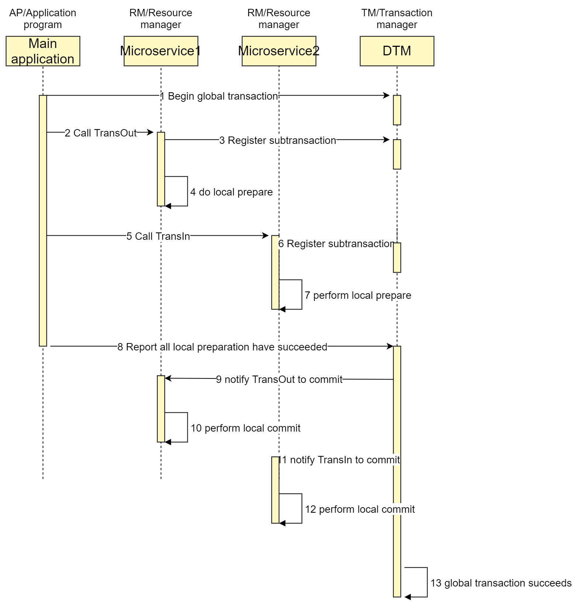
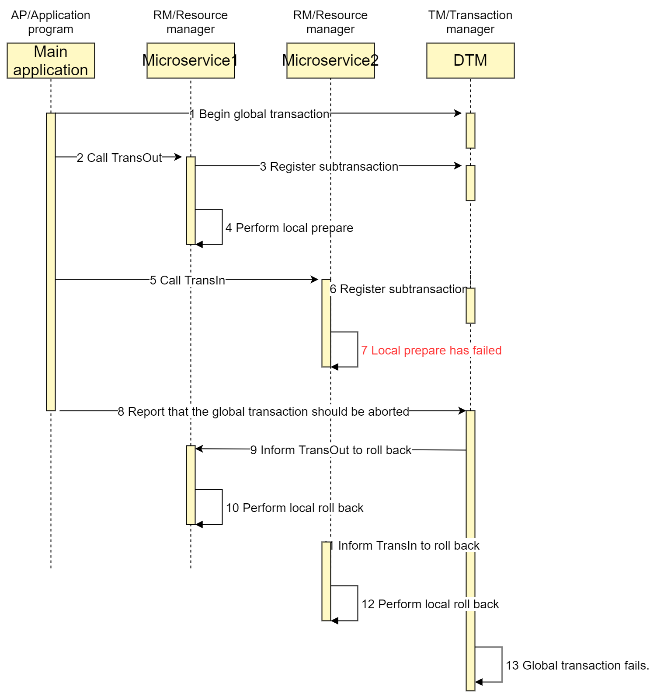

# Understanding XA Transactions with Pratical Examples

## What is XA

XA is a specification for distributed transactions proposed by the X/Open organization.
The X/Open Distributed Transaction Processing (DTP) model envisages three software
components:
- An application program (AP) defines transaction boundaries and specifies actions that constitute a transaction.
- Resource managers (RMs, such as databases or file access systems) provide access to shared resources.
- A separate component called a transaction manager (TM) assigns identifiers to transactions, monitors their progress, and takes responsibility for transaction completion and for failure recovery.

The following figure illustrates the interfaces defined by the X/Open DTP model.


XA is divided into two phases.

 - Phase 1 (prepare): All participating RMs prepare to execute their transactions and lock the required resources.
   When each participant is ready, it report to TM.

 - Phase 2 (commit/rollback): When the transaction manager (TM) receives that all participants (RM) are ready, it sends commit commands to all participants. Otherwise, it sends rollback commands to all participants.

At present, almost all popular databases support XA transactions, including Mysql, Oracle, SqlServer, and Postgres

## XA in Mysql
Let's see how database Mysql supports XA.

``` sql
XA start '4fPqCNTYeSG' -- start a xa transaction
UPDATE `user_account` SET `balance`=balance + 30,`update_time`='2021-06-09 11:50:42.438' WHERE user_id = 1
XA end '4fPqCNTYeSG'
-- if connection closed before prepare, then the transaction is rollback automaticly
XA prepare '4fPqCNTYeSG'

-- When all participants have all prepared, call commit in phase 2
xa commit '4fPqCNTYeSG'

-- When any participants have faled to prepare, call rollback in phase 2
-- xa rollback '4fPqCNTYeSG'
```

## Business Scenario
An inter-bank transfer is a typical distributed transaction scenario, where A needs to transfer money across a bank to B. Both the withdraw and the deposit may succeed of fail, and it is required that the sum of balance of A and B should not change after the transfer finished, regardless of any errors that occur.

## Implement a Distributed XA Transaction

Distributed XA transactions can solve the above business problem. This article presents a solution based on [dtm-labs/dtm](https://github.com/dtm-labs/dtm). DTM is a popular distributed transaction framework which support XA, Saga, OutBox, and TCC patterns.

A successful global transaction timing diagram is like this:



The code to implement it in Go is quite simple:

``` go
gid := dtmcli.MustGenGid(dtmutil.DefaultHTTPServer)
err := dtmcli.XaGlobalTransaction(dtmutil.DefaultHTTPServer, gid, func(xa *dtmcli.Xa) (*resty.Response, error) {
  resp, err := xa.CallBranch(&busi.TransReq{Amount: 30}, busi.Busi+"/TransOutXa")
  if err != nil {
    return resp, err
  }
  return xa.CallBranch(&busi.TransReq{Amount: 30}, busi.Busi+"/TransInXa")
})

app.POST(BusiAPI+"/TransInXa", dtmutil.WrapHandler2(func(c *gin.Context) interface{} {
	return dtmcli.XaLocalTransaction(c.Request.URL.Query(), BusiConf, func(db *sql.DB, xa *dtmcli.Xa) error {
		return AdjustBalance(db, TransInUID, reqFrom(c).Amount, reqFrom(c).TransInResult)
	})
}))
app.POST(BusiAPI+"/TransOutXa", dtmutil.WrapHandler2(func(c *gin.Context) interface{} {
	return dtmcli.XaLocalTransaction(c.Request.URL.Query(), BusiConf, func(db *sql.DB, xa *dtmcli.Xa) error {
		return AdjustBalance(db, TransOutUID, reqFrom(c).Amount, reqFrom(c).TransOutResult)
	})
}))
```

The above code first registers a global XA transaction, and then calls two sub-transactions TransOut, TransIn.
After all the sub-transactions are executed successfully, the global XA transaction is committed to DTM.
DTM receives the committment of the XA global transaction, then calls the `xa commit` of all the sub-transactions, and finally change the status of global transaction to succeeded.

Code samples in other languages can be found here: [SDKs](https://en.dtm.pub/ref/sdk)

## Run It
You can run the above example by running the following commands.

#### Run DTM
``` bash
git clone https://github.com/dtm-labs/dtm && cd dtm
go run main.go
```

#### Run Example
``` bash
git clone https://github.com/dtm-labs/dtm-examples && cd dtm-examples
go run main.go http_xa
```

## Rollback upon Failure

If any `prepare` operation fails, DTM will call `xa rollback` of each sub-transaction to roll back, and finally change the status of the global transaction to failed.

Let's pass `TransInResult="FAILURE"` in the request payload of XaFireRequest to triger failure.

``` go
req := &busi.TransReq{Amount: 30, TransInResult: "FAILURE"}
```

The timing diagram for failure is as follows:



#### Notices
- The command of second phase, is also sent to the API `BusiAPI+"/TransOutXa"`, and within this service, `dtmcli.XaLocalTransaction` will automatically call `xa commit` | `xa rollback`. So the body of the request is nil, and parsing body operations, such as the previous `reqFrom`, need to be placed inside `XaLocalTransaction`, otherwise the body parsing will result in errors.

## TM Failure
 The complexity of two-phase commit comes from all the failure scenarios that can arise. The most annoying failure happens after a participant has acknowledged prepared and before it receives the decision, such as a failure of the coordinator.

 Out solution to this failure is quite simple. Since most of cloud vendors provide highly-available databases, we can store the progress of sub-transactions in these databases, run multiple instance of TMs. Each instance will poll the paused transactions and continue to process them.

## Advantages and Disadvantages
Compare to other patterns like SAGA and TCC, the advantages of XA global transactions are:
- Simple and easy to understand
- Automatic rollback of business, no need to write compensation manually

The disadvantages of XA are:
- Need the XA transaction from underlying database
- Data is locked from data modification until the commitment, much longer than other patterns. It not suitable for highly concurrent business.

## Conclution
In this article, I've introduce the basic principle of XA transaction, and presents a praticle example of it. Readers can easily follow the example to handle their own businesses.

Welcome to visit [github.com/dtm-labs/dtm](https://github.com/dtm-labs/dtm). It is a dedicated project to make distributed transactions in microservices easier. It supports multiple languages, and multiple patterns like a 2-phase message, Saga, TCC, and XA.

