# Cache Consistency

## Overview
In real-world projects, when application QPS gets high, it is common to introduce Redis caching to ease the pressure on database queries. But once the cache is introduced, then a data is stored in both Redis and database, there will be a data consistency problem. DTM is committed to solving the data consistency problem, and after analyzing the existing practices in the industry, we propose a new architecture solution, which will be described in detail in this article

## Strong Consistency
When the business load is not high, we can directly access the database, such a solution is simple and direct, no problem.

When the business volume increases, the database can easily become a bottleneck, the most convenient solution is to upgrade the underlying hardware, so that the database directly provides higher qps to cope with business growth. The advantage of this solution is that it does not require any development work, but has the following disadvantages.
- There are upper limits to upgrade the underlying hardware, the IOPS of the disk, the memory of the standalone machine, and the CPU of the standalone machine, and at a certain point, it is impossible to upgrade upwards
- Hardware upgrade is very expensive, the performance of these Hardware doubled, the cost may be 4 times, or even 10 times, this solution hardware costs rise too quickly, it is difficult to cope with the large number of users of the application

**Development impact:** This solution, the application does not require any modification at all.

## Database Replication
The above hardware upgrade is very developer friendly, but the cost is too expensive and the drawbacks are very obvious, so is there a way to do horizontal scaling so that the cost just rises linearly?

The vast majority of Internet applications are read and write applications, the use of master-slave replication of the database, read and write separation, can better cope with the problems caused by the rise in the number of users, compared with the above hardware upgrade solution. Master-slave separation has the following characteristics
- With the growth of users, you can lighten the pressure of database by adding more slave databases, the cost is linear, not exponential increase, better than the previous vertical upgrade solution
- Theoretically, a master can add a large number of slaves, and the upper limit of such expansion is much higher than the upper limit of the previous vertical upgrade scheme

But the scheme here is already eventually consistent, and it takes some time for the data to move from the master to the slave. After the application writes on the master library, it immediately goes to the slave to read, it may not read the latest data, so it is eventual consistency.

**Development Impact:** With this eventual consistency solution, development would need to make changes for the application. Development would need to distinguish between read requests with strong consistency requirements, and read requests with not-strong consistency requirements, and schedule the strong consistency to the master, and the not-strong consistency to the slave.

## Redis Caching
The above database solution is very high in terms of cost per user. In today's Internet applications, where the number of users is very high, a pure database solution would result in high costs, and other technology solutions would be a better choice.

Using Redis to cache data in memory is a very common data query solution today, and compared to the database solution described above, the Redis solution has the following features.
- Data is stored in memory and access is extremely fast, with standalone Redis typically providing up to 10 to 100 times qps access than standalone databases
- Redis also supports master-slave replication, sharding, etc., making it easy to provide the qps required by the application

Redis provides perfect support for concurrent access, but it also poses a number of problems.
- Redis stores data in memory, which is not in the same format as a database, and requires manual maintenance by the developer.
- Redis does not have automatic data synchronization with the database in the same way as the previous database master-slave, so the consistency of the relevant data needs to be maintained manually by the developer.

**Development Impact:** Developers need to manually maintain cached data in a different format than the database, and they also need to solve the problem of inconsistent data between the Redis cache and the database.

## Why Inconsistent
With the introduction of the Redis cache, data is stored in both the database and Redis, and the industry generally uses a strategy of deleting/updating cached data after writing to the database. Since saving to the cache and saving to the database are not atomic operations, there must be a time difference between the two operations, so there is a window of inconsistency between the two data, which is usually not long. However, there may be downtime and various network errors in between, so it may happen that one of them is completed but not the other, resulting in a longer inconsistency in the data.

To illustrate the above inconsistency scenario, a data user modifies data A to B. After the application modifies the database, it then modifies the cache, and if no exception occurs, the data in both the database and the cache are B. However, in a distributed system, process crashes and downtimes may occur, so if a process crash occurs after updating the database and before updating the cache, then the data in the database and cache may be inconsistent for a longer period of time.

It is not an easy task to solve the above inconsistency problem, so we will introduce the solutions for various applications.

## 1: Short cache time
This solution, the simplest one, is suitable for applications with little concurrency. If the qps of the application is not high, then the entire caching system, are supposed to set a short cache time, such as one minute. The load that the database needs to bear in this case is that about every minute, all the cached data that is accessed needs to be generated once, and this strategy is feasible in the case of low concurrency.

This strategy described above is very simple and easy to understand and implement. The semantics provided by the caching system is that the time window for inconsistency between the cache and the database is short in most cases, and in the case of process crashes, the inconsistency window can be as long as one minute.

While reads with strong consistency requirements do not go to the cache and are queried directly from the database.

## 2: MQ to ensure consistency
If the application has high concurrency, the cache expiration time needs to be longer than one minute, and the large number of requests in the application cannot tolerate inconsistency for a longer period of time, then this time, the cache can be deleted/updated by using a message queue. This is done as follows.
- When updating the database, simultaneously write the message to update the cache to the local table and commit it as the database update operation is committed.
- Write a polling task that continuously polls messages in the local table, and sends messages to the message queue.
- Consume the messages in the message queue and update/delete the cache

This approach ensures that the cache will definitely be updated after the database is updated. However, this architecture is very heavy, and the development and maintenance costs of these parts are hight: maintenance of the message queue; development and maintenance of efficient polling tasks.

## 3: Subscribe binlog
This scenario is very similar to Solution 2, and the principle is similar to the master-slave synchronization of database. The master-slave synchronization is applied to the slave, and this solution is applied to the cache manager, which apply the updates of database to the cache. The specific approach is.
- deploy and configure a binlog subscribing component to subscribe to the database binlog
- listen to data updates and synchronizely update/delete cache

This solution also ensures that the cache will be updated after the database is updated, but this architectural solution is very heavy, just like the previous one. On the one hand, binlog subscribing component is expensive to learn and maintain, on the other hand, developers may only need a small amount of data to update the cache, and it is wasteful to do this by subscribing to all binlogs.

## 4: 2-phase messaging
The 2-phase message solution in dtm is perfect for updating/deleting the cache after modifying the database here, with the following main code.

``` Go
msg := dtmcli.NewMsg(DtmServer, gid).
	Add(busi.Busi+"/UpdateRedis", &Req{Key: key1})
err := msg.DoAndSubmitDB(busi.Busi+"/QueryPrepared", db, func(tx *sql.Tx) error {
  // update db data with key1
})
```

In this code, DoAndSubmitDB will perform a local database operation to modify the database data, and when the modification is complete, it will submit a 2-phase message transaction, which will call UpdateRedis asynchronously. 2-phase messaging ensures that UpdateRedis will be executed at least once if the local transaction is committed successfully.

If there is a crash just after commit and before submit message, dtm will call `QueryPrepared` to check. The checkback logic is very simple, just copy code like the following.
``` Go
	app.GET(BusiAPI+"/QueryPreparedB", dtmutil.WrapHandler2(func(c *gin.Context) interface{} {
		return MustBarrierFromGin(c).QueryPrepared(dbGet())
	}))
```

Advantages of this solution:
- The solution is simple and easy to use, the code is short and easy to read
- dtm itself is a stateless common application, relying on the storage engine redis/mysql which is a common infrastructure, without maintaining additional message queues or canal
- The related operations are modular and easy to maintain, no need to write consumer logic elsewhere like message queues or canal

## Update or delete cache?
When data changes, you can choose to update the cache or delete it, each with its own advantages and disadvantages. We try to analyze their advantages and disadvantages and propose a new approach below.

#### Delete cache
If we adopt the delete cache strategy and then generate cache on demand when querying, then in the case of high concurrency, if a hot data is deleted, then a large number of requests will fail to hit the cache at that time.

To prevent too many query going to DB, a common practice is to use distributed Redis locks to ensure that only one request goes to the database, and then the other requests share the result after the cache is generated. This solution can be suitable for many scenarios, but some scenarios are not. For example, if there is an important hot data, and the computation cost is relatively high and it takes 3s to get the result, then the above solution will have a large number of requests last for 3s to return the result at this moment after removing one such hot data. This may cause a large number of requests to time out on the one hand, and on the other hand, 3s does not release the link, which will lead to a sudden increase in the number of concurrent connections and may cause system instability.

In addition, when using Redis locks, the part of users who have not obtained the lock will usually poll the lock regularly, and this sleep time is not well set. If you set a relatively large sleep time of 1s, it is too slow to return cached data with results calculated in 200ms; if you set a sleep time that is too short, it consumes too much CPU and Network resources.

#### Update Cache
If we adopt the update cache strategy, the problem is that the cache is regenerated for each data modification, and there is no distinction between hot and cold data, which wastes the associated storage and computational resources.

#### Delayed deletion
So is there a best-of-both-worlds solution? One that doesn't waste storage and compute resources, but also solves the cache-breakdown problem? Yes, there is! The deferred-delete method. The deferred-delete method works as follows.
1. when the data changes, look for the data in Redis, if the data does not exist, do nothing; if the data exists, then mark the data as deleted and set the expiration time of the data to 10s.
2. When reading data from the cache, if the data is found to be marked as deleted or the lock has expired, then mark the data as locked until now+4s, then go to the database and read the data, then write it to the cache and clear the mark.
3. When reading data from the cache, if the data is found to be marked as locked, then return the old data, and if there is no old data, then sleep 1s and try again

This delayed deletion method has the following advantages.
1. cold data does not take up a lot of storage and computing resources, only the requested data will generate cache and take up storage space
2. the above-mentioned cache breakdown does not occur. When the hot data cache is updated, the old data will be returned when the cached data is calculated in these 3s, avoiding situations such as request timeouts

Let's see if there are any problems with the delayed deletion method in various cases.
1. Hot data, 1K qps, calculation of the cache costs 5ms: For this case, the delayed deletion method update the DB first, calculate the cach for 5ms, and then update the cache. That is in about 5ms, will return the expired data.
2. Hot data, 1K qps, calculation of the cache costs 3s; For this case, the delayed deletion method update the DB first, calculate the cach for 3s, and then update the cache. That is in about 3s, will return the expired data.
3. Normal data, 0.2 qps, calculation of the cache costs 3s; Similar to 2
4. Code data, 10 minutes to access once: Delayed deletion method will not keep the data in cache for long.

There is an extreme case, that is, there is no data in the original cache, and suddenly a large number of requests arrive. This scenario is not friendly to any caching strategy. Such scenarios are to be avoided by developers and need to be solved by warming up, rather than being handled at the caching system.

Delayed deletion can handle all kinds of situations in the cache very well, the principle is slightly more complicated to write and needs to be implemented through lua scripts, but the advantage is that it can be implemented as a sdk, fully reused and does not need to be done by every developer.

For those interested, you can refer to [dtm-cases/cache](https://github.com/dtm-labs/dtm-cases/tree/main/cache) for detailed examples.

## Inconsistency by disorder
The inconsistency described earlier is mainly caused by the inability to update the database and update the cache at the same time, and the window of inconsistency is the time difference between the two updates. But there is another kind of data inconsistency, which has a lower probability of occurrence. Here we take a look at the timing diagram for this case.



In the above timing diagram, since Service 1 has a process suspension (e.g. due to GC), when it writes v1 to the cache, it overwrites v2 in the cache, resulting in an inconsistency (v2 in DB, v1 in cache).

How to solve this kind of problem? In fact, this kind of problem is a version-related problem, and the recommended solution is to use a version control similar to optimistic locking. We have implemented a cache deferred deletion scheme that can solve this problem perfectly. The solution principle is as follows.

The data in the cache has the following fields.
- Empty
- Data lock time: when a process wants to update the cache, then lock the cache for a short time, then query the DB, and then update the cache
- Data locker uuid
- Deleted

When querying the cache.
1. If the cache data is not locked, and the data is empty or marked as deleted
  a. Lock the data for n seconds, the locker is the requested uuid
  b. Get the data from the database
  c. Determine if the locker of the data is the current request uuid, if yes, update the cache; if no, do not update the cache
2. If the data in the cache is locked and the data is empty
  a. sleep 1s and re-query the cache
3. other data cases
  a. Return the data in the cache directly (regardless of whether the data has been marked for deletion)

When DB data is updated, deferred deletion of cache is guaranteed by dtm
- In deferred delete, mark the data as deferred deleted and clear the data lock time and clear the locker uuid

Under the above policy.

If the last version written to the database is Vi, the last version written to the cache is V, and the uuid written to V is uuidv, then the following sequence of events must exist.

database write Vi -> cached data is marked as deleted -> some query locks data and set uuidv -> query database result V -> locker in cache is uuidv, write result V

In this sequence, V occurs after writing Vi, so V equals Vi, ensuring the evetual consistency of the cached data

For those interested, you can refer to [dtm-cases/cache](https://github.com/dtm-labs/dtm-cases/tree/main/cache) for detailed examples.

## Strong Consistency for APP?
The various scenarios for cache consistency have been described above, along with related solutions, so is it possible to guarantee the use of caching while still providing strongly consistent data reads and writes?

When we discuss strong consistency here, we need to first make the meaning of consistency clear.

A developer's intuitive understanding of strong consistency is likely to be that the database and cache are identical, and that the latest writes are available during and after the write, whether read directly from the database or directly from the cache. For this kind of "strong consistency", we can say very clearly that it is theoretically impossible, because updating the database and updating the cache are on different machines and cannot be done at the same time, and there will be a time interval anyway, in which there must be inconsistency.

But strong consistency in the application layer is possible. One can simply consider familiar scenarios: CPU cache for memory, memory cache for disk, these are caching scenarios where no consistency problem ever occurs. Why? It's actually quite simple: all data users are required to to read data from the cache only, not from both the cache and the underlying storage at the same time.

For DB and Redis, as long as we require all data reads to go through the cache, then it is strongly consistent and no inconsistency will occur. Let's analyze the design of DB and Redis based on their characteristics.

#### Update cache or DB first
Analogous to CPU cache and memory cache, both systems modify the cache before modifying the underlying storage, so when it comes to the current DB caching scenario does it also modify the cache before modifying the DB?

In the vast majority of application scenarios, developers will consider Redis as a cache, and when Redis fails, then the application needs to support degradation processing and still be able to access the database and provide certain service capabilities. Considering this scenario, once the downgrade occurs, writing to the cache before writing to the DB is problematic, as it will read to the new version v2 and then read to the old version v1. Therefore, in the Redis as cache scenario, most systems will adopt the design of writing to the DB before writing to the cache

#### Write DB success bu cache failure
What if the process crashes after the write to the DB succeeds, so the mark delayed delete fails? Although it will retry successfully after a few seconds, but during these seconds, the user goes to read the cache, the old version of data is still there. For example, if a user initiates a recharge and the funds are already in the DB, only the update of the cache fails, resulting in the balance seen from the cache is still the old value. The handling of this situation is simple: when the user  writes to the DB successfully, the application does not return success to the user, but waits until the cache update is also successful before returning success to the user; when the user queries the recharge transaction, he has to query whether both the DB and the cache are successful, and only when both are successful will success be returned.

Under the above processing strategy, when a user initiates a recharge, before the cache update is completed, the user sees that the transaction is still being processed and the result is unknown, then it still meets the requirement of strong consistency.

#### Processing of Degraded Upgrades
Now let's consider the handling of a downgrade applied to a problem with the Redis cache. Generally this upgrading and downgrading switch is in the configuration center, and when the configuration is modified, each application process is notified of the configuration change one after another and then downgraded in behavior. In the process of downgrading, there will be mixed access to cache and DB, and then there is a possibility of inconsistency in our above solution. So how can we handle this to ensure that the application still gets strong consistent results in this mixed access situation?

In the process of mixed access, we can adopt the following strategy to ensure the data consistency in the mixed access of DB and cache.
- When updating data, use distributed transactions to ensure the following operations are atomic operations
  - Mark the cache as "updating"
  - Update DB
  - Remove the cache "update in progress" flag and mark it as delayed delete
- When reading cached data, for the data marked as "updating", sleep and wait before reading again; for the data with delayed deletion, do not return the old data, and wait for the new data to finish before returning.
- When reading DB data, it is read directly without any additional operation.

The detailed process of downgrading needs to be as follows.
1. initial state: all read cache, write DB+cache
2. open read downgrade switch: partly read cache, partly read DB, write DB+cache
3. read downgrade completed: all read DB, write DB+cache
4. Open write downgrade switch: all read DB, some write DB only, some write DB+cache
5. Write downgrade complete: all read DB, all write DB only

The upgrade process is the opposite, as follows.
1. initial state: all read DB, all write only DB
2. open write upgrade switch: all read DB, some write only DB, some write DB + cache
3. Write upgrade completed: all read DB, all write DB+cache
4. Open read upgrade switch: partly read cache, partly read DB, all write DB+cache
5. read upgrade complete: all read cache, all write DB+cache

For those interested, you can refer to [dtm-cases/cache](https://github.com/dtm-labs/dtm-cases/tree/main/cache) for detailed examples.

## Summary
This article is very long, many of the analysis is rather obscure, and the use of the cache will be summarized.
- The simplest way is: shorter cache time, allowing a small amount of database modification, not synchronized with the deletion of the cache
- A more consistent way is: 2-phase message + delete cache
- The eventually consistent way which can prevent cache breakdowns is: 2-phase message + delayed deletion
- The strong consistent way is: 2-phase message + delayed delete + read/write switches
