# Flash-sales
This article introduces a new architecture that completely solves the core pain points in flash-sales architecture. The architecture can support over 10,000 orders per second for accurate inventory deduction and ensure that the data for creating orders and deducting inventory are eventually strictly consistent.

## Problems of existing system
Existing flash-sales architectures, in order to support high concurrency, usually put inventory in Redis and perform inventory deduction in Redis when an order request is received. This design results in order creation and inventory deduction not being atomic operations, which can lead to inconsistent data if a process crash or other problem is encountered in between the two operations.

Even if the inventory deduction is not placed in Redis, but in the database, the inconsistency problem is usually present. Business systems separate the inventory service from the order service in order to modularize and reduce coupling. As long as they are separate services, then data inconsistencies are unavoidable.

Problems such as process crashes, although not highly probable, can produce data inconsistencies even if they account for one percent or even one thousandth of the total, such as inconsistencies between the amount of inventory deducted and the orders created successfully.

Inventory and order data inconsistency is a difficult problem that must be solved. The common practice is that developers go through the order data and calibrate the inventory data, which is a very tedious and complicated part of the job, consuming a lot of development work, and very often requires manual intervention to manually verify and fix the data.

Let's see how the new architecture solves this problem elegantly
## Overall architecture
We clarify the business scenario and we extract the core points of the flash-sales system as follows.
- Users will send a large number of requests to the backend at some point in time, and the number of requests will be much higher than the number of inventory
- The back-end needs to ensure that the inventory deduction and order creation are strictly consistent in the end, even if the process crashes in the middle, the final data will not be affected

In the above scenario, the vast majority of requests for stock deduction descriptions will fail with the following timing diagram.



In this architecture, the distributed transaction framework dtm is used. In the timing diagram above, the inventory deduction is performed in Redis, and the global transactions associated with dtm are also handled in Redis. It is relying on Redis throughout, independent of the database, and therefore able to support extremely high concurrency. As you can see from the test data later, this architecture can easily handle tens of thousands of flash-sales requests per second.

Although most of the requests end because the stock deduction fails, there will be a certain number of requests where the stock deduction is successful, and the timing diagram for this case is as follows.



In this timing diagram, a successful inventory deduction leads to the order service for order-related creation and subsequent payment. In this new architecture, the order service only needs to process valid orders. At this point, the concurrency has dropped significantly, and the problem can be easily solved by only conventional methods, such as order sub-banking and table splitting, and message queue peak shaving processing.

## Atomic operations
In the above architecture, if a process crash occurs in Redis after the inventory is deducted and before the global transaction is committed, it will result in two operations not completing at the same time, so what happens subsequently to this situation? How does the new architecture ensure that the data ends up being strictly consistent? The timing diagram for the entirety of this situation is as follows.



Once this type of process crash occurs, resulting in the interruption of two operational processes, then the dtm server will poll the timeout for outstanding transactions, and if there is a global task that has been Prepared and not Submitted, then he will call the backcheck API and ask the application if the inventory deduction was successfully deducted. If it has been deducted, then the global transaction is committed and subsequent calls are made; if it has not been deducted, then the global transaction is marked as failed and is not processed again.

The principle of guaranteeing atomic operations, and the strategy for handling various cases of dtm when they occur, can be found in [2-phase messages](../practice/msg), which is not described in detail here.

## Core code

The core code of the spike interface is as follows.
``` Go
gid := "{a}flash-sale-" + activityID + "-" + uid
msg := dtmcli.NewMsg(DtmServer, gid).
	Add(busi.Busi+"/createOrder", gin.H{activity_id: activityID, UID: uid})
err := msg.DoAndSubmit(busi.Busi+"/QueryPreparedRedis", func(bb *BranchBarrier) error {
  return bb.RedisCheckAdjustAmount(rds, "{a}stock-"+stockID, -1, 86400)
})
```

- Line 1: For a general flash-sales, a user can only buy once, so using the activity id + user id as the global transaction ID ensures that the user can generate at most one global transaction and create at most one order
- Line 2: Create a 2-phase message object, fill in the dtm server address, and the global transaction id
- Line 3: Add a branch to the 2-phase message that serves to create the order
- Line 4: Call the DoAndSubmit of the 2-phase message. The first parameter of the function is the URL of the backcheck (see the backcheck in the figure above); the second parameter is a callback function that will contain the business logic. This function executes the transaction and commits the global transaction upon success, ensuring that the execution of the transaction and the commit of the global transaction are "atomic"
- Line 5: RedisCheckAdjustAmount is called, which performs the inventory deduction. When this function performs the inventory deduction, it returns an error if there is not enough inventory; if there is enough inventory, it deducts the inventory and records that the inventory has been deducted successfully, which ensures that the operation is idempotent and that subsequent backchecks get the correct result

The core code of the backcheck is as follows.
``` Go
	app.GET(BusiAPI+"/QueryPreparedRedis", dtmutil.WrapHandler2(func(c *gin.Context) interface{} {
		return MustBarrierFromGin(c).RedisQueryPrepared(rds)
	}))
```
The logic for the developer to write the backcheck is simple, for data inside Redis, just copy and paste the code above this. The detailed principle of counter-checking is described in [2-phase message](../practice/msg). The documentation for 2-phase messages describes how to do it in the database, while here a similar backchecking logic is done with Redis, so we won't go into details.

## Performance
As you can see from the above, for most requests that fail to deduct inventory, only three Redis operations are required:
1. register the global transaction;
2. debit the inventory;
3. modify the global transaction to fail.

These three operations are all implemented in lua scripts. A normal redis can support about 6w lua script operations per second. Based on this analysis, our new architecture can, in theory, support 2w spike requests per second. The performance test report I did shows that when dtm shares a redis with deducted inventory, it can easily complete 1.2w flash-sales orders per second, reaching 60% of the theoretical limit, you can refer to the performance test report later for details

For further analysis, the deduction inventory and the global transaction can use different Redis, so
- Deducted inventory: If supported by a separate Redis, then the theoretical upper limit for deducted inventory is 60,000/s, and the predicted actual value is 60,000 * 0.6 = 36,000/s. If we go further and use Redis6's multi-threaded IO, we can get higher performance, reaching about 60,000 * 2.5 * 0.6 = 90,000/s.
- Global transactional operations: And the dtm in this only needs to deploy multiple groups, or use a clustered version in the future, to provide support well beyond 90,000/s.
- So with the new architecture, it is expected that 9w/s of second request traffic can be achieved

The above analysis is still limited to installing Redis on the virtual machines of ordinary cloud vendors themselves. If Redis can provide more robust performance through a simple hardware upgrade, or by using the Redis provided by the cloud customized, the above 9w/s can be increased by another step.

Referring to the peak order rate of Ali's Double 11: 583,000 orders/second, the above predicted 90,000/s is sufficient for almost all flash-sales

## Code example
For a complete runnable code example, you can refer to [dtm-cases/flash](https://github.com/dtm-labs/dtm-cases/tree/main/flash)

## Flash-sales performance test details
Tested environment, two Ali cloud hosts, type: ecs.hfc5.3xlarge 12 core CPU 3.1GHz/3.4GHz PPS 1.3 million
- One machine running Redis
- The other machine is running the test program

Test procedure.
#### Preparing Redis
Select virtual machine A to install Redis

``` bash
apt-get install -y redis
# Modify /etc/redis/redis.conf
# bind 127.0.0.1 => 0.0.0.0

systemctl redis restart
```

#### prepare dtm
Select virtual machine B to install dtm
``` bash
apt update
apt install -y git

wget https://golang.org/dl/go1.17.1.linux-amd64.tar.gz
rm -rf /usr/local/go && tar -C /usr/local -xzf go1.17.1.linux-amd64.tar.gz && cp -f /usr/local/go/bin/go /usr/local/bin/go

git clone https://github.com/dtm-labs/dtm.git && cd dtm && git checkout v1.11.0 && cd bench && make
# modify dtm/bench/test-flash-sales.sh
# export BUSI_REDIS=localhost:6379 => private ip of virtual machine A
```

#### to run the test

``` bash
sh test-flash-sales.sh
```

#### Get the results

My results show that I was able to complete about 1.2w spike requests per second: the
```
Requests per second: 11970.21 [#/sec] (mean)
```

## Summary
We propose a new spike architecture that can guarantee the atomicity of creating orders and deducting inventory, and is predicted to quickly support 90,000/s of flash-sales request traffic. It helps everyone to solve the business requirements of flash-sales better and faster.