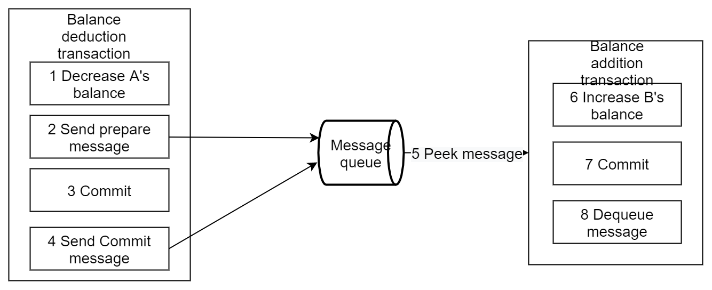

# The seven most classic solutions for distributed transaction management

With the rapid development of business and increasing business complexity, almost every company's system will move from the monolithic architecture to a distributed, especially microservice-based one.
Naturally with this change comes the challenging difficulty of distributed transactions.

This article first introduces the relevant basic theories, then summarizes the most classic transaction solutions, and finally figures out elegant solutions to the out-of-order execution of sub-transactions (idempotence, null compensation, suspension problems).

## Basic theory

Before explaining the our DTM solution, let's review some basic theoretical knowledge necessary for distributed transactions.

Let's take a money transfer as an example: A wants to transfer $100 to B.
What needs to be done is thus to subtract $100 from A's balance and to add $100 to B's balance.
The guarantee must be provided that the entire transfer, namely A-$100 and B+$100, either succeeds or fails atomically as a whole.
Let's see how this problem is solved in various scenarios.

### Transactions

The functionality to execute multiple statements as a whole is known as a database transaction.
A database transaction ensures that all operations within the scope of that transaction either all succeed or all fail.

Transactions have four properties: atomicity, consistency, isolation, and persistence.
These four properties are commonly referred to as ACID characteristics.

- Atomicity: All operations in a transaction either complete or do not complete, but never end at some point in the middle.
  A transaction that meets an error during execution is rolled back so that the system is restored to the state it was in before the transaction began, as if the transaction had never been executed.

- Consistency: The integrity of the database is not broken before the transaction starts and after the transaction ends.
  Integrity including foreign key constraints, application-defined constraints, etc, will not be broken.

- Isolation: The database allows multiple concurrent transactions to read, write and modify its data at the same time.
  Isolation prevents data inconsistencies due to cross-execution when multiple transactions are executed concurrently.

- Persistence: After the transaction is finished, the modification of the data is permanent and will not be lost even if the system fails.

If our business system is simple and the transfer can be accomplished in only one service and also in only one database, then we can take the solution of database transactions.

### Distributed transactions

A typical distributed transaction scenario is the inter-bank money transfer.
Suppose A needs to transfer money to B across banks.
The scenario involves data from two banks, thus the ACID of the transfer cannot be guaranteed by a local transaction in one database, but only be solved by a distributed transaction.

A distributed transaction means that the transaction initiator, the resource and resource manager and the transaction coordinator are located on different nodes of the distributed system.
In the above inter-bank transfer scenarios, the A-$100 operation and the B+$100 operation are not located on the same node.
In essence, distributed transactions aims to ensure the correct execution of data operations in a distributed scenario.

On one hand, distributed transactions follow the BASE (Basically Available, Soft state, and Eventually consistent) theory in a distributed environment in order to meet the needs of availability, performance and degraded services, while reducing the requirements of consistency and isolation:

- Basic Availability
- Soft state
- Eventual consistency

On the other hand, distributed transactions also partially follow the ACID specification.

- Atomicity: strict compliance
- Consistency: Consistency after the transaction is completed is strictly followed; consistency in the transaction can be relaxed appropriately
- Isolation: no influence between parallel transactions; visibility of intermediate results of transactions is allowed to be relaxed in a safe manner
- Persistence: Strictly followed

## Solutions for distributed transaction management

For distributed transaction, there is no perfect solution for all business problems, because the complete ACID guarantees cannot be achieved. Therefore, in actual applications, we should choose the most suitable distributed transaction solution according to the different characteristics of the business.

### Two-phase commit/XA

XA is a specification for distributed transactions proposed by the X/Open organization.
The XA specification mainly defines the interface between a (global) Transaction Manager (TM) and a (local) Resource Manager (RM).
Local databases such as mysql play the RM role in the XA specification.

XA is divided into two phases.

 - Phase 1 (prepare): All participating RMs prepare to execute their transactions and lock the required resources.
   When the participants are ready, they report to TM that they are ready.

 - Phase 2 (commit/rollback): When the transaction manager (TM) confirms that all participants (RM) are ready, it sends a commit command to all participants.

At present, almost all mainstream databases support XA transactions, including mysql, oracle, sqlserver, postgre

XA transaction consists of one or more resource manager (RM), one transaction manager (TM), and one application program (AP).

Taking the inter-bank transfer as an example,  the timing diagram for a successful XA transaction is shown below:：


If a prepare phase operation of any participant fails, DTM will call xa rollback of each child transaction to roll back, and the transaction is successfully rolled back at last.

The features of XA transactions are

- Simple to understand and easier to develop
- Long locking of resources and low concurrency

If readers want to study XA further, refer to [DTM](https://github.com/yedf/dtm).

# SAGA

SAGA originally appeared in the paper [SAGAS](https://www.cs.cornell.edu/andru/cs711/2002fa/reading/sagas.pdf) published by Hector Garcia-Molina and Kenneth Salem in 1987.
The key idea is to write a long-lived transaction as multiple short local transactions, collectively termed as a SAGA and coordinated by the SAGA transaction coordinator.
If all sub-transactions of a SAGA complete, the SAGA completes successfully.
If one sub-transaction fails, the compensating transactions will be invoked one at a time in the reverse order.

Suppose we want to perform an inter-bank transfer.
A typical timing diagram for a successfully completed SAGA transaction would be as follows:


Features of SAGA transactions are:

- High concurrency, no long-term locking of resources like XA transactions
- Need to define normal operation and compensation operation, thus the development demand is higher than XA
- Weak consistency. Taking transferring money for example, the intermediate state where the money has been deducted from user A's account but the transfer fails finally may be seen

Our discussion here only includes the simplest SAGA.
There are more SAGA contents in the paper, including two recovery strategies, including parallel execution of branch transactions.

SAGA is applicable to a wide range of scenarios, including long transactions and business scenarios that are not sensitive to intermediate results.

If readers want to study SAGA further, refer to [DTM](https://github.com/yedf/dtm).

### TCC

TCC (Try, Confirm, Cancel), and was first proposed by Pat Helland in 2007 in the paper called "Life beyond Distributed Transactions: an Apostate's Opinion".

TCC is divided into 3 phases

- Try phase: The requestor requests the service provider to perform a tentative operation.
  The provider shall complete all business validations (consistency), and reserve required business resources (quasi-isolation).

- Confirm phase: If the provider completes the Try phase successfully, the requestor can execute a confirmation operation on the provider if it decides to move forward.
  The Confirm phase is where the business is actually conducted.
  No more business validations will be performed, and only those business resources reserved in the Try phase will be used.
  The Confirm phase needs to be idempotent.
  Furthermore, the Confirm phase retries if it fails.

- Cancel phase: The requestor can execute a cancellation operation on the provider if it decides not to move forward, e.g., when the provider does not complete the Try phase successfully.
  Business resources reserved in the Try phase should be released in the Cancel phase.
  Just like the Confirm phase, The Cancel phase needs to be idempotent, and retires if fails.

Suppose we want to perform an inter-bank transfer, using TransOut and TransIn implemented in separate micro-services.
Normally we freeze the back account in Try (no deduction yet), decrease the balance in Confirm, and unfreeze in Cancel.
A typical timing diagram for a successfully completed transaction using the TCC transaction model is as follows:


The features of TCC are the following:

- Higher concurrency and no long-term resource locking.
- Higher demand on development, since we need to provide Try/Confirm/Cancel interface.
- Consistency is better than SAGA, where intermediate state of balance deduction but transfer failure may occur
- TCC is thus suitable for order-related business with constraints on intermediate state

If readers want to study TCC further, refer to [DTM](https://github.com/yedf/dtm).

### Local Messaging

The Local Messaging solution was originally published to ACM by ebay architect Dan Pritchett in 2008.
The key idea is to introduce a persistent message queue to execute tasks that require distributed processing in an asynchronous manner.

The general flow is as follows:


By queueing a persistent message within the same transaction as the business operation, the atomicity of that business operation and messaging is guaranteed.
They either all complete or they both fail.

Fault tolerance:

- When the balance deduction transaction fails, the transaction is rolled back directly, with no subsequent steps

- When the polling of messages produced or the balance addition transaction fails, it will be retried

Features of Local Messaging:

- Long transactions only need to be split into multiple tasks, which is easy to use

- Producers need to create additional message tables

- Each local message table needs to be polled

- Consumer-side logic requires additional mechanisms to roll back operations if they do not succeed by retrying

The Local Messaging model is suitable for asynchronous tasks that need no rollback operations.

### Transactional Messaging

In the local messaging solution described above, the producer is responsible for creating and polling the local message table, leading to severe burden.
RocketMQ opensourced by alibaba supports Transactional Messaging starting from v4.3 version.
What RocketMQ essentially does is to deligate the local message table to RocketMQ, to achieve the atomicity on the producer's side to send message and execute local transaction.

Transactional Messaging model:

- Sending a message (half message)
- The server stores the message and responds with the result of writing the message
- Execute the local transaction according to the result of sending (if the write fails, the half message is not visible to the business and the local logic is not executed)
- Execute Commit or Rollback according to the status of the local transaction (Commit operation publishes the message and the message is visible to the consumer)

The flow chart for normal sending is as follows.



Compensation process:

A "check" is initiated from the server for messages with no Commit/Rollback (messages in the pending state).
Producer receives the check message and returns the status of the local transaction corresponding to the message as Commit or Rollback.
The transactional messaging model is very similar to the local messaging model.
The main difference is that the local table operation is replaced by a check interface.

Features of the Transactional Messaging model are the following:

- Only need to split long transactions into multiple tasks, and provide a backchecking interface, which is simple to use
- Consumer logic requires additional mechanisms to roll back operations if they fail to succeed through retries

Suitable for operations that can be executed asynchronously and where subsequent operations do not need to be rolled back

Refer to [rocketmq](https://github.com/apache/rocketmq) if you want to further study transaction messages.
Our [DTM](https://github.com/yedf/dtm) also provides a implementation.

### Best-effort Notification

The initiating notifier notifies the receiver of the result of the business processing with a certain mechanism of best effort.
Specifically:

- Notification of messages can be repeated.
  Because the receiving side may not receive the notification, there should be some mechanism to repeat the notification of the message.

- Messages can be checked.
  If the receiver is not notified even after maximum efforts, or if the receiver consumes the message but wants to consume it again, the receiver should be allowed to actively query the message information from the initiating notifier.

What is the difference between the Local Messaging and the Transactional Messaging models introduced earlier, which both produce reliable messages, and the Best-effort Notification model introduced here?

With the former two models, the initiating notifier ensures that the message is sent out and then to the receiving side.
In other words, the reliability of the message is guaranteed by the notifying side.

With the Best-effort Notification model, the initiating notifier does its best to notify the result of the business processing to the receiver, but the message may still not be received.
As a result, the receiving side needs to actively call the initiating notifier's interface to query the result of the business processing, which means that the reliability of the notification relies on the receiving side.

A solution using the Best-effort Notification model should:

- Provide an interface to allow the receiving side to actively query the results of the business processing

- Setup ACK mechanism of messaging, which means the notification interval is gradually increased with the interval of 1min, 5min, 10min, 30min, 1h, 2h, 5h, 10h, until it reaches the upper limit of the time window of notification requirements.
  No further notifications are made after that.

Best-effort Notification is applicable to business notification scenarios.
For example, the results of WeChat transactions are notified to each merchant through Best-effort Notification model, with both callback notifications and transaction query interfaces.

Best-effort Notification can be considered more of a business design.
In the infrastructure layer, one can use Transaction Messaging directly.

### AT

This is a transaction pattern implemented in the Ali open source project [Seata](https://github.com/seata/seata), also known as FMT in Ant Financial Services.

- The advantage of this transaction model is similar to the XA model.
  The business code does not need to provide all kinds of compensation operations, and rollback is done automatically by the framework.

- The Disadvantage is also similar to XA.
  The locking is longer and does not meet the high concurrency scenario.

Please refer to [Seata-AT](http://seata.io/zh-cn/docs/dev/mode/xa-mode.html) if you are interested to know more.

## Exception handling

Network failures and business problems can happen in all aspects of distributed transactions.
Consequently, the business side of distributed transactions need to implement the three characteristics of anti-empty rollback, idempotent, and anti-suspension.

### Exceptions

Common exceptions are illustrated using the TCC transaction model:

**Empty Rollback:**

The second-stage Cancel method is called without calling the Try method of TCC.
The Cancel method needs to recognize that this is an empty rollback and then return success directly.

The reason for this exception is that when the node assigned to the branch is down in service or facing network abnormalities, the branch transaction call will be recorded as a failure, although there is actually no execution of the Try phase.
When the service is returned, the distributed transaction manager opts for rollback that calls the Cancel method of the second phase, thus resulting into an empty rollback.

**Idempotent:**

Since any one request can have network exceptions and duplicate requests happen, all distributed transaction branches need to guarantee to be idempotent.

**Suspension:**

A suspension is a distributed transaction for which the second-stage Cancel interface is executed before the Try interface.
The Try method needs to recognize that this is a suspension and return a direct failure.

The reason for this exception is that when a branch transaction try is called via RPC, the expected order is to registered branch transaction first, and then make the RPC call.
If the network infrastructure for the RPC call is congested at this time, the RPC will timeout, after which TM will notify RM to roll back the distributed transaction.
Suspension occurs if the rollback cannot be completed before the RPC request reaches the participant for real execution.

## Causes of Exceptions

See below a timing diagram of a network exception to better understand the above types of problems


- When the business processes request 4, Cancel is executed before Try, resulting into null rollback that needs addressing

- When business processing request 6, Cancel is executed repeatedly and needs to be handled in an idempotent manner

- When business processing request 8, Try is executed after Cancel, resulting into suspension that needs addressing

## Exception problems

In the face of the above complex network anomalies, the proposed solutions given by various distributed transaction frameworks are currently seen to be mainly the following: The business side queries whether the associated operation has been completed by a unique key, and returns success directly if it has been completed.

For the above scheme, each business needs to be handled separately, and the related judgment logic is more complex, error-prone and business-loaded, which is a pain point for landing distributed transactions.

We will present dtm's original solution in the next section.

### Sub-transaction barriers

We have pioneered the sub-transaction barrier technique in [https://github.com/yedf/dtm](https://github.com/yedf/dtm).
The outcome of using sub-transaction barrier is shown below:


For all requests that arrive at the sub-transaction barrier: abnormal requests are filtered; validated requests pass through the barrier.
After the developer uses the sub-transaction barrier, all kinds of exceptions described earlier in the tutorial are handled properly.
The business developer only needs to focus on the actual business logic, and the burden is greatly reduced.
The sub-transaction barrier technique provides the method ThroughBarrierCall, signature of which is shown below:

``` go
func ThroughBarrierCall(db *sql.DB, transInfo *TransInfo, busiCall BusiFunc)
```

Business developers write their specific business logic inside busiCall, and call ThroughBarrierCall with it.
ThroughBarrierCall guarantees that busiCall will not be called in scenarios such as empty rollback, suspension, etc, and that, when the business service is called repeatedly, proper idempotent control ensures that it is committed only once.

sub-transaction barrier recognizes and manages TCC, SAGA, XA,  transaction messages, etc., and can also be extended to other areas.

#### Mechanism

The mechanism of sub-transaction barrier technology is to create a branch transaction status table sub_trans_barrier in the local database, with the unique key of global transaction id - sub-transaction id - sub-transaction branch name (try|confirm|cancel).

- Open transaction

- If it is Try branch, insert ignore gid-branchid-try.
  If insert is successful, call the logic inside the barrier.

- If it is Confirm branch, insert ignore gid-branchid-confirm
  If insert is successful, invoke the in-barrier logic.

- If it is Cancel branch, insert ignore gid-branchid-try and then gid-branchid-cancel.
  If try is not inserted but cancel is inserted successfully, call the in-barrier logic.

- The logic inside the barrier completes successfully, commits the transaction, and returns success.

- If the logic inside the barrier returns an error, the transaction is rolled back and an error is returned.

With this mechanism, network exception-related problems are solved.

- Empty compensation control.
  If Try is not executed and Cancel is executed directly, the Cancel inserting gid-branchid-try will succeed and the logic inside the barrier is not taken, ensuring empty compensation control.

- Idempotent control.
  Any branch can not repeat the insertion of unique keys, to ensure that no repeated execution.

- Anti-hanging control.
  When Try is executed after Cancel, the inserted gid-branchid-try will not be executed if it is unsuccessful, ensuring anti-hanging control.

For SAGA and transaction messages, it is a similar mechanism.

#### Summary for sub-transaction barrier

Sub-transaction barrier technology, pioneered by [https://github.com/yedf/dtm](https://github.com/yedf/dtm), is significant in designing simple and easy-to-implement algorithms and providing easy-to-use interfaces.
With the help of these two items, developers are completely freed from the handling of network exceptions.

The technology currently requires the [yedf/dtm](https://github.com/yedf/dtm) transaction manager, and the SDK is currently available to developers of the go/python language.
SDKs for other languages are in the planning stage.
For other distributed transaction frameworks, as long as the appropriate distributed transaction information is provided, the technology can be quickly implemented using DTM according to the above principles.

## Summary

This article introduces some basic theory of distributed transactions and explains the commonly used distributed transaction schemes.
In the second half of the article, it also gives the causes of transaction exceptions, their classification and elegant solutions.

Our [yedf/dtm](https://github.com/yedf/dtm) supports TCC, XA, SAGA, transactional messaging, and maximum effort notifications (implemented using transaction messages), with concise and easy-to-use access.

Welcome to visit the [https://github.com/yedf/dtm](https://github.com/yedf/dtm) project and star for support!
