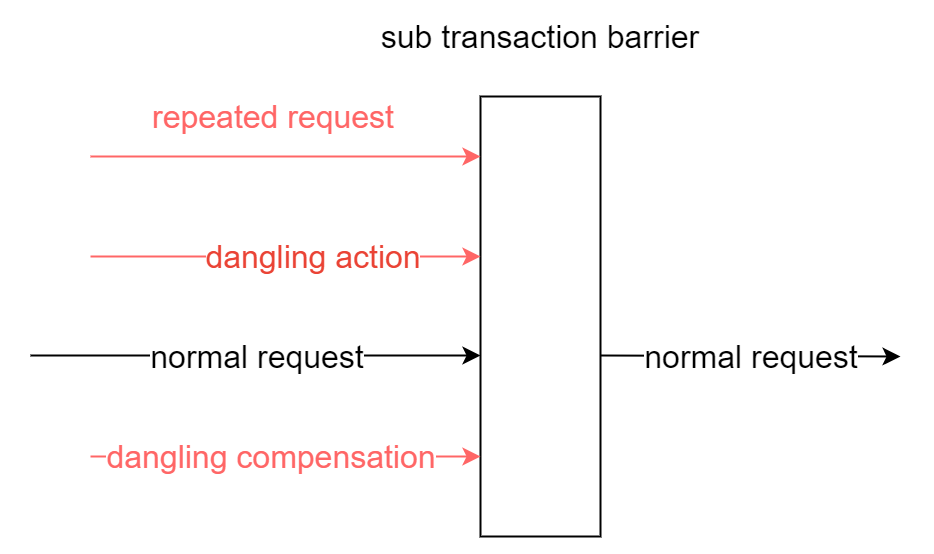

# Subtransaction barriers

## Functionality

We have pioneered the subtransaction barrier technique in dtm.
The outcome of using subtransaction barrier is shown below:



For all requests that arrive at the subtransaction barrier: abnormal requests are filtered; validated requests pass through the barrier.
After the developer uses the subtransaction barrier, all kinds of exceptions described earlier in the tutorial are handled properly.
The business developer only needs to focus on the actual business logic, and the burden is greatly reduced.
The subtransaction barrier technique provides the method ThroughBarrierCall, signature of which is shown below:


``` go
func (bb *BranchBarrier) Call(db *sql.DB, busiCall BusiFunc) error
```

Business developers write their specific business logic inside busiCall, and call BranchBarrier.Call with it. 
BranchBarrier.Call guarantees that busiCall will not be called in scenarios such as empty rollback, suspension, etc, and that, when the business service is called repeatedly, proper idempotent control ensures that it is committed only once.

Subtransaction barrier recognizes and manages TCC, SAGA, transaction messages, etc., and can also be extended to other areas.

## Mechanism

The mechanism of subtransaction barrier technology is to create a branch transaction status table sub_trans_barrier in the local database, with the unique key of global transaction id - subtransaction id - subtransaction branch name (try|confirm|cancel).

- Open transaction

- If it is Try branch, insert ignore gid-branchid-try.
  If insert is successful, call the logic inside the barrier.

- If it is Confirm branch, insert ignore gid-branchid-confirm
  If insert is succeedful, invoke the in-barrier logic.

- If it is Cancel branch, insert ignore gid-branchid-try and then gid-branchid-cancel.
  If try is not inserted but cancel is inserted successfully, call the in-barrier logic.

- The logic inside the barrier completes successfully, commits the transaction, and returns success.

- If the logic inside the barrier returns an error, the transaction is rolled back and an error is returned.

With this mechanism, network exception-related problems are solved.

- Empty compensation control.
  If Try is not executed and Cancel is executed directly, the Cancel inserting gid-branchid-try will succeed and the logic inside the barrier is not taken, ensuring empty compensation control.

- Idempotent control.
  Any branch can not repeat the insertion of unique keys, to ensure that no repeated execution.

- Anti-hanging control.
  When Try is executed after Cancel, the inserted gid-branchid-try will not be executed if it is unsuccessful, ensuring anti-hanging control.

For SAGA and transaction messages, it is a similar mechanism.

## Combining common orm libraries

barrier provides sql standard interface, but everyone's application usually introduces more advanced orm, instead of using sql interface directly, so it needs to be transformed.
The following gives a few common orm library adaptation examples:

### gorm

Example code used is as follows.

``` go
	sdb, err := gdb.DB() // gdb is a *gorm.DB
	if err ! = nil {
		return nil, err
	}
	barrier := MustBarrierFromGin(c)
	return dtmcli.ResultSuccess, barrier.Call(sdb, func(sdb *sql.Tx) error {
		tx := SQLTx2Gorm(sdb, gdb)
		return tx.Exec("update dtm_busi.user_account set balance = balance + ? where user_id = ?" , req.Amount, 1).Error
	})

// SQLTx2Gorm build a gorm.DB from SqlTx
func SQLTx2Gorm(stx *sql.Tx, db *gorm.DB) *gorm.DB {
	tx := db.Session(&gorm.Session{Context: db.Statement.Context})
	tx.Statement.ConnPool = stx
	return tx
}

```

## Summary

The subtransaction barrier technique is developed by DTM. 
The significance includes

- Simple algorithm and easy to implement
- A unified system solution, easy to maintain
- Easy-to-use interface

With the help of this subtransaction barrier technology, developers are completely freed from the handling of network exceptions. 
With DTM's subtransaction barrier, only one senior development engineer is required to handle such exceptions.

This technology currently requires a DTM transaction manager, and the SDK is currently available to developers of the go language.
Other languages' sdk is under planning. 
For other distributed transaction frameworks, as long as the appropriate distributed transaction information is provided, the technology can also be implemented quickly according to the above principles.
