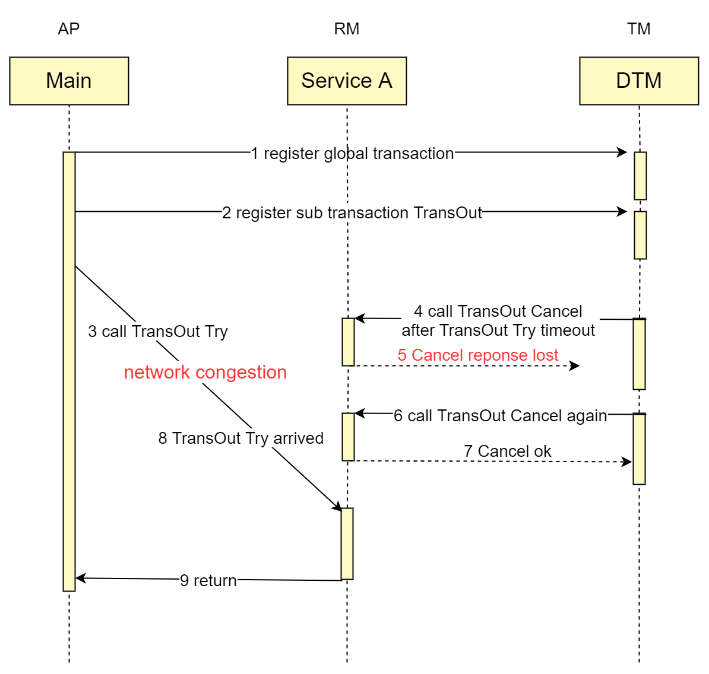

# Exceptions

## Exception categories

Common exceptions are illustrated using the TCC transaction model:

**Empty Rollback:**

The second-stage Cancel method is called without calling the Try method of TCC.
The Cancel method needs to recognize that this is an empty rollback and then return success directly.

**Idempotent:**

Since any one request can have network exceptions and duplicate requests happen, all distributed transaction branches need to guarantee to be idempotent.

**Suspension:**

A suspension is a distributed transaction for which the second-stage Cancel interface is executed before the Try interface.
The Try method needs to recognize that this is a suspension and return a direct failure.

## Causes of Exceptions

See below a timing diagram of a network exception to better understand the above types of problems

- When the business processes request 4, Cancel is executed before Try, resulting into null rollback that needs addressing

- When business processing request 6, Cancel is executed repeatedly and needs to be handled in an idempotent manner

- When business processing request 8, Try is executed after Cancel, resulting into suspension that needs addressing

## Exception problems

In the face of the above complex network anomalies, the proposed solutions given by various distributed transaction frameworks are currently seen to be mainly the following:

> The business side queries whether the associated operation has been completed by a unique key, and returns success directly if it has been completed.

For the above scheme, each business needs to be handled separately, and the related judgment logic is more complex, error-prone and business-loaded, which is a pain point for landing distributed transactions.

We will present dtm's original solution in the next section.
