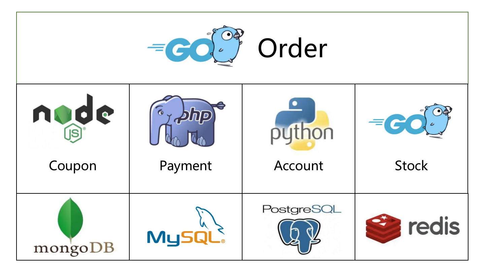

# Introduction

## What is DTM

DTM is a distributed transaction framework which provides cross-service eventual data consistency. It provides saga, tcc, xa, 2-phase message, outbox patterns for a variety of application scenarios. It also supports multiple languages and multiple store engine to form up a transaction as following:



Learn more behind the design of DTM in [why choose DTM](./why).

## Who's using DTM (partial)

[Tencent](https://www.tencent.com/)

[Bytedance](https://www.bytedance.com/)

[Ivydad](https://ivydad.com)

[More ...](../other/using)

<a style="
    background-color:#646cff;
    font-size: 0.9em;
    color: #fff;
    margin: 0.2em 0;
    width: 200px;
    text-align: center;
    padding: 12px 24px;
    display: inline-block;
    vertical-align: middle;
    border-radius: 2em;
    font-weight: 600;
" href="../other/opensource">Comparison to Seata</a>

## Features

* Extremely easy to adopt
  - Support HTTP and gRPC, provide easy-to-use programing interfaces, lower substantially the barrier of getting started with distributed transactions, newcomers can adopt quickly

* Easy to use
  - Relieving developers from worrying about suspension, null compensation, idempotent transaction, and other tricky problems, the framework layer handles them all

* Language-agnostic
  - Suitable for companies with multiple-language stacks.
    Easy to write bindings for go, python, php, nodejs, ruby and other languages.

* Easy to deploy, easy to extend
  - DTM depends only on mysql, easy to deploy, cluster, and scale horizontally

* Support for multiple distributed transaction protocol
  - TCC, SAGA, XA, Transactional messages

Invited speaker at the China Database Conference. [Distributed Transaction Practice in Multi-Language Environment](http://dtcc.it168.com/yicheng.html#b9)

## Quick start

::: tip Basics to have
This tutorial also assumes that you have some basic programming knowledge and can understand GO code in general. If you are not familiar with this, you can visit [golang](https://golang.google.cn/).
:::

#### run dtm

``` bash
git clone https://github.com/dtm-labs/dtm && cd dtm
go run main.go
```

#### Start the example

``` bash
git clone https://github.com/dtm-labs/dtmcli-go-sample && cd dtmcli-go-sample
go run main.go
```

In this example, a saga distributed transaction is created and then committed to dtm, with key code shown below:

``` go
	req := &gin.H{"amount": 30} // micro-service load threshold
	// DtmServer is the address of DTM micro-service
	saga := dtmcli.NewSaga(DtmServer, dtmcli.MustGenGid(DtmServer)).
		// add a TransOut subtraction，forward operation with url: qsBusi+"/TransOut", reverse compensation operation with url: qsBusi+"/TransOutCompensate"
		Add(qsBusi+"/TransOut", qsBusi+"/TransOutCompensate", req).
		// add a TransIn subtraction, forward operation with url: qsBusi+"/TransIn", reverse compensation operation with url: qsBusi+"/TransInCompensate"
		Add(qsBusi+"/TransIn", qsBusi+"/TransInCompensate", req)
	// submit the created saga transaction，dtm ensures all subtractions either complete or get revoked
	err := saga.Submit()
```

The entire transaction completes successfully eventually with the following timing diagram:


In a real business, it is possible that a sub-transaction may fail.
For example, the destination sub-account is freezed, causing the transfer to fail.
Let's modify the business code to purposely fail the forward operation of TransIn and watch what happens.

``` go
	app.POST(qsBusiAPI+"/TransIn", func(c *gin.Context) {
		c.JSON(409, "") // Status 409 for Failure. Won't be retried
	})

```

Running the example again, the whole transaction eventually fails with the following timing diagram:


Notice that in case the transfer operation fails, the TransIn and TransOut compensation branches are executed, ensuring that the final balance is the same as it was before the transfer.

## Ready to try?

We have just briefly described a complete distributed transaction, including a success, and a rollback.
Now that you should have a concrete understanding of distributed transactions in DTM, keep learning this tutorial to learn step-by-step the technical solutions and techniques for handling distributed transactions.

## Slack
You can join the [DTM slack channel here](https://join.slack.com/t/dtm-w6k9662/shared_invite/zt-vkrph4k1-eFqEFnMkbmlXqfUo5GWHWw)
