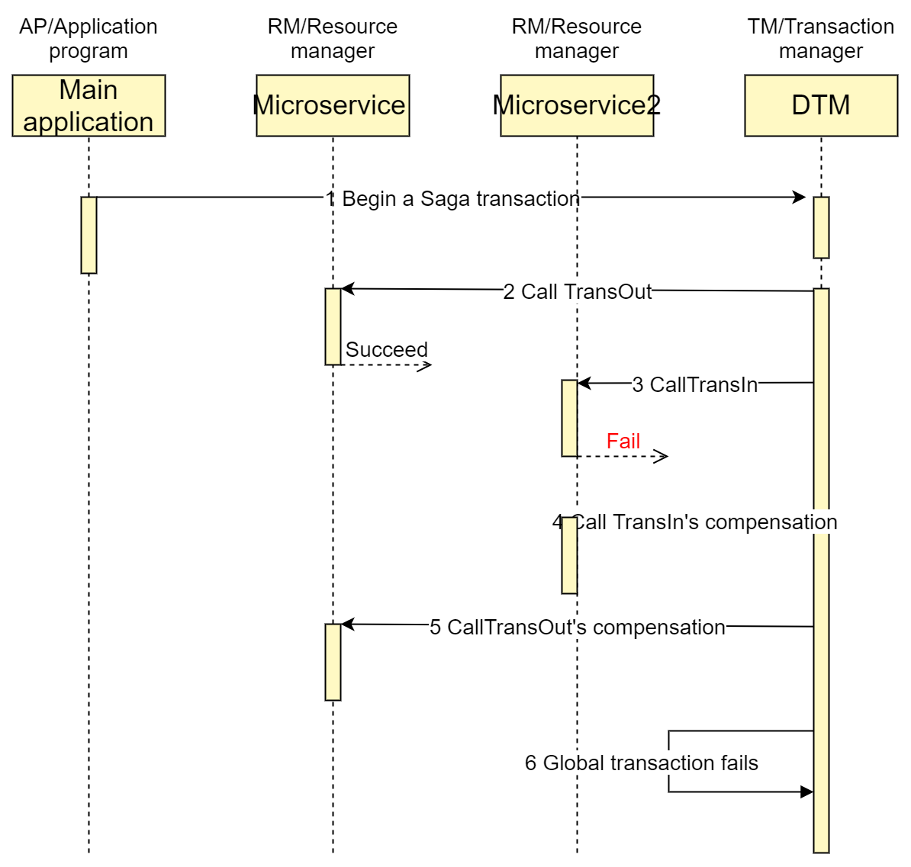

# Introduction

## What is DTM

DTM is the first distributed transaction management framework in golang.
Unlike other frameworks, DTM provides extremely easy access to HTTP and gRPC, supports multiple language bindings, and handles tricky problems of unordered sub-transactions at the framework level.

Learn more behind the design of DTM in [why choose DTM](./why).

## Features

* Extremely easy to adopt
  - Support HTTP and gRPC, provide easy-to-use programing interfaces, lower substantially the barrier of getting started with distributed transactions, newcomers can adopt quickly

* Easy to use
  - Relieving developers from worrying about suspension, null compensation, idempotent transaction, and other tricky problems, the framework layer handles them all

* Language-agnostic
  - Suitable for companies with multiple-language stacks.
    Easy to write bindings for go, python, php, nodejs, ruby and other languages.

* Easy to deploy, easy to extend
  - DTM depends only on mysql, easy to deploy, cluster, and scale horizontally

* Support for multiple distributed transaction protocol
  - TCC, SAGA, XA, Transactional messages

Invited speaker at the China Database Conference. [Distributed Transaction Practice in Multi-Language Environment](http://dtcc.it168.com/yicheng.html#b9)

## Companies that adopt dtm

[Ivydad 常青藤爸爸](https://ivydad.com)

[Eglass 视咖镜小二](https://epeijing.cn)

<a style="
    background-color:#646cff;
    font-size: 0.9em;
    color: #fff;
    margin: 0.2em 0;
    width: 200px;
    text-align: center;
    padding: 12px 24px;
    display: inline-block;
    vertical-align: middle;
    border-radius: 2em;
    font-weight: 600;
" href="../other/opensource">Comparison to Seata</a>

## start

::: tip Basics to have
This tutorial assumes that you already have basic knowledge of distributed transactions. If you are not familiar with this, first read [Theory of Distributed Transactions](../guide/theory).

This tutorial also assumes that you have some basic programming knowledge and can understand GO code in general. If you are not familiar with this, you can visit [golang](https://golang.google.cn/).
:::

- [install](./install) use the golang idiomatic way

The easiest way to try DTM is to run the QuickStart example, the main file of which is at [dtm/example/quick_start.go](https://github.com/yedf/dtm/blob/main/examples/quick_start.go).

You can run the example in the dtm directory with the following command

`go run app/main.go quick_start`

In this example, a saga distributed transaction is created and then committed to dtm, with key code shown below:

``` go
	req := &gin.H{"amount": 30} // micro-service load threshold
	// DtmServer is the address of DTM micro-service
	saga := dtmcli.NewSaga(DtmServer, dtmcli.MustGenGid(DtmServer)).
		// add a TransOut subtraction，forward operation with url: qsBusi+"/TransOut", reverse compensation operation with url: qsBusi+"/TransOutCompensate"
		Add(qsBusi+"/TransOut", qsBusi+"/TransOutCompensate", req).
		// add a TransIn subtraction, forward operation with url: qsBusi+"/TransIn", reverse compensation operation with url: qsBusi+"/TransInCompensate"
		Add(qsBusi+"/TransIn", qsBusi+"/TransInCompensate", req)
	// submit the created saga transaction，dtm ensures all subtractions either complete or get revoked
	err := saga.Submit()
```

This distributed transaction demo simulates a scenario in a distributed transaction for cross-bank transfers.
The master transaction is comprised of two sub-transactions, TransOut (transfer money out from source account) and TransIn (transfer money into destination account), both consisting of forward operations and reverse compensation, defined as follows:

``` go
func qsAdjustBalance(uid int, amount int) (interface{}, error) {
	err := dbGet().Transaction(func(tx *gorm.DB) error {
		return tx.Model(&UserAccount{}).Where("user_id = ?", uid).Update("balance", gorm.Expr("balance + ?", amount)).Error
	})
	if err != nil {
		return nil, err
	}
	return M{"dtm_result": "SUCCESS"}, nil
}

func qsAddRoute(app *gin.Engine) {
	app.POST(qsBusiAPI+"/TransIn", common.WrapHandler(func(c *gin.Context) (interface{}, error) {
		return qsAdjustBalance(2, 30)
	}))
	app.POST(qsBusiAPI+"/TransInCompensate", common.WrapHandler(func(c *gin.Context) (interface{}, error) {
		return qsAdjustBalance(2, -30)
	}))
	app.POST(qsBusiAPI+"/TransOut", common.WrapHandler(func(c *gin.Context) (interface{}, error) {
		return qsAdjustBalance(1, -30)
	}))
	app.POST(qsBusiAPI+"/TransOutCompensate", common.WrapHandler(func(c *gin.Context) (interface{}, error) {
		return qsAdjustBalance(1, 30)
	}))
}
```

The entire transaction completes successfully eventually with the following timing diagram:


In a real business, it is possible that a sub-transaction may fail.
For example, the destination sub-account is freezed, causing the transfer to fail.
Let's modify the business code to purposely fail the forward operation of TransIn and watch what happens.

``` go
	app.POST(qsBusiAPI+"/TransIn", common.WrapHandler(func(c *gin.Context) (interface{}, error) {
		return M{"dtm_result": "FAILURE"}, nil
	}))
```

Running the example again, the whole transaction eventually fails with the following timing diagram:



Notice that in case the transfer operation fails, the TransIn and TransOut compensation branches are executed, ensuring that the final balance is the same as it was before the transfer.

## Ready to try?

We have just briefly described a complete distributed transaction, including a success, and a rollback.
Now that you should have a concrete understanding of distributed transactions in DTM, keep learning this tutorial to learn step-by-step the technical solutions and techniques for handling distributed transactions.

## Slack

You can join the [DTM slack channel here](https://join.slack.com/t/dtm-w6k9662/shared_invite/zt-vkrph4k1-eFqEFnMkbmlXqfUo5GWHWw)

## Give a Star! ⭐

If you think this project is good, or helpful to you, please give a star!