# Mysql storage engine performance test report

Because there are no official performance test reports for other distributed transaction frameworks, there is no comparative data with other frameworks. However, we did a comparative analysis of dtm's performance with mysql's ideal performance. The analysis shows that DTM's additional overhead is very small, and the main performance bottlenecks are in the database's transactional capability and sql throughput

## Test Environment

| machine| CPU/memory | storage | system|Mysql|
|:-----:|:----:|:----:|:----:|:----:|
| Aliyun ecs.c7.xlarge | 4 cores 8G | 500G ESSD IOPS 26800|Ubuntu 20.04|Docker mysql:5.7|

## Testing process

``` bash
# In the dtm directory
git checkout fec4957
docker-compose -f helper/compose.mysql.yml up -d # Start Mysql

# Run sysbench to test against mysql
sysbench oltp_write_only.lua --time=60 --mysql-host=127.0.0.1 --mysql-port=3306 --mysql-user=root --mysql-password= --mysql-db=sbtest -- table-size=1000000 --tables=10 --threads=10 --events=999999999 --report-interval=10 prepare
sysbench oltp_write_only.lua --time=60 --mysql-host=127.0.0.1 --mysql-port=3306 --mysql-user=root --mysql-password= --mysql-db=sbtest -- table-size=1000000 --tables=10 --threads=10 --events=999999999 --report-interval=10 run

go run app/main.go bench > /dev/nul # Start bench service for dtm, no logs, redirect to nul device
bench/run-dtm.sh # Start a new command line to run all dtm related tests
```

## Test metrics

We will compare the following metrics.

- Global-TPS: How many global transactions were completed from the user's perspective.
- DB-TPS: the number of transactions completed at DB level in each test
- OPS: How many SQL statements were completed in each test

## Result Comparison

| |Mysql|No DTM-2SQL|DTM-0SQL|DTM-2SQL|DTM-2SQL-Barrier|No DTM-10SQL|DTM-10SQL|DTM-10SQL-Barrier|
|:---:|:--:|:--:|:--:|:--:|:--:|:--:|:--:|:--:|
|Global-TPS|-|1232|935|575|531|551|357|341|
|DB-TPS|2006|2464|1870|2300|2124|1102|1428|1364|
|OPS|12039|4928|5610|5750|6372|10620|9282|9548|

## Mysql Performance

We started with testing the performance of Mysql itself. In this performance test of DTM, there are more write operations, so we mainly tested the performance of Mysql write this time.

We used the otp_write_only benchmark in sysbench, in which each transaction contains 6 write SQL (with insert/update/delete).

In this benchmark, the number of completed transactions per second is about 2006, and the number of completed SQLs is about 12039. These two results will be quoted in the subsequent DTM-related tests.

## DTM Testing

There are various transaction mode involved in distributed transactions, and we choose a representative simple Saga pattern as a representative to analyze the performance of distributed transaction DTM.

The Saga transaction we selected contains two sub-transactions, one is TransOut transfer out balance and one is TransIn transfer in balance. The TransIn and TransOut each contain two Sql, which are update balance and record log respectively.

#### No DTM-2SQL

We first test the case without DTM, that is, calling TransOut and TransIn directly, and the test result is that 1232 global transactions are completed per second. Each global transaction contains two sub-transactions, TransOut and TransIn, so DB-TPS is 2464, and then each sub-transaction contains two SQL, so the total SQL operation is 4928.

This result compares MYSQL, DB-TPS is higher, while DB-SQL is only half, mainly because each transaction needs to synchronize data to disk, which requires additional performance consumption, and at this time the bottleneck is mainly in the system database transaction capability

#### DTM-0SQL

We then test the case of using DTM. After using DTM, the timing diagram of a SAGA transaction is as follows.



The DTM in the global transaction will include 2 transactions: save the global transaction + branch operation, and modify the global transaction to completed. Modifying each transaction branch operation to completed also requires one transaction each, but DTM uses asynchronous writing for merging and reducing transactions.

The number of SQL included in each global transaction in DTM is: 1 save global transaction, 1 save branch operation, 1 read all branch operations, 2 modify branch operations as completed, 1 modify global transaction as completed, 6 SQL in total.

In the test result, the number of global transactions completed per second is 935, then DB-TPS is 1870, OPS is 5610. from this result, a 4-core 8G machine on mysql, can carry 935 transactions per second, enough for most of the companies.

#### DTM-2SQL

If we include the SQL in the business and calculate the total throughput change with the distributed transaction scheme, then

The global transaction will include 2 transactions of DTM, and two business transactions of TransIn and TransOut, which is 4 transactions in total.

The number of SQLs included in the global transaction is: 6 SQLs of dtm, plus 4 SQLs of business subtransactions is 10.

In the test result, the number of global transactions completed per second is 575, then the DB-TPS is 2300 and the OPS is 5750, compared with the previous solution without DTM, the DB-TPS drops slightly and the OPS has a certain increase, the bottleneck is still in the system database

#### DTM-2SQL-Barrier

After adding the subtransaction barrier, each transaction branch operation will have one more insert statement, and the number of SQL corresponding to each global transaction is 12.

In the test result, the number of global transactions completed per second is 531, so the DB-TPS is 2124 and the OPS is 6372, comparing with the previous DTM solution, the DB-TPS is slightly decreased and the OPS is slightly increased, as expected

#### No DTM-10SQL

We adjust the data of the press test, adjust the number of SQL in each subtransaction, from 2 to 10, and execute the SQL in the subtransaction 5 times in a loop.

The number of global transactions completed per second is 551, the DB-TPS is 1102, and the OPS is 10620. The OPS in this result is close to that of MYSQL, and the bottleneck is mainly in the OPS of the database.

#### DTM-10SQL

In this compression test result, the number of global transactions completed per second is 357, DB-TPS is 1428, and OPS is 9282, where OPS is down by more than ten percent compared to the case without DTM, mainly because DTM's table has more fields and indexes, and the execution overhead of each SQL will be larger, so the total OPS will be lower.

#### DTM-10SQL-Barrier

In the test result, the number of global transactions completed per second is 341, so the DB-TPS is 1364 and the OPS is 9548, comparing with the previous DTM solution, the DB-TPS is slightly lower and the OPS is slightly higher, as expected.

## Summary

From the comparison of DTM's performance test results with MYSQL's performance test data, the additional overhead generated by DTM is very small and has maximized the utilization of the database's capacity.

An ecs.c7.xlarge+500G disk Aliyun server with mysql installed and serving DTM alone is able to provide about nearly a thousand Global-TPS at a monthly cost of 900 RMB (October 2021 price), which is low compared to the business capacity provided.

If you need more robust performance, you can purchase a higher-matched configuration, or you can deploy multiple DTMs at the application layer. The cost of both options is not too high and is sufficient to meet the needs of the vast majority of companies.
