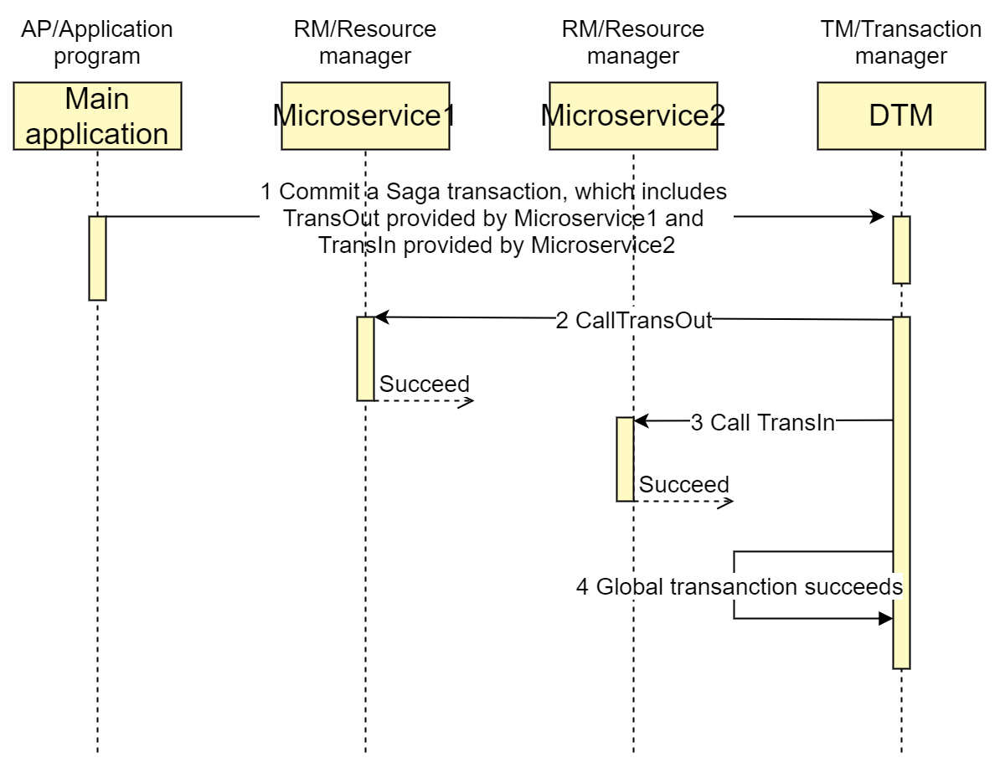
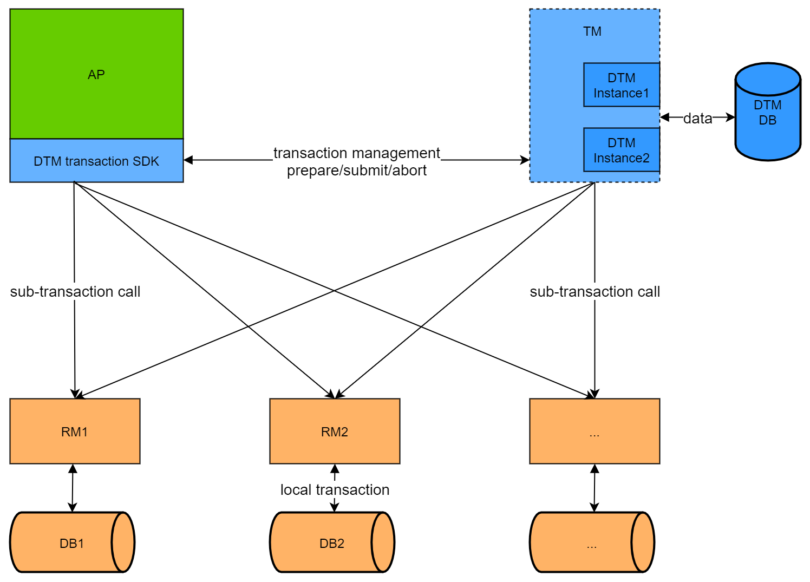

# DTM Architecture

We will first briefly introduce a complete distributed transaction, and after you understand the process of distributed transaction, then we will introduce the DTM architecture in detail.

## Distributed transaction process

Suppose we want to make an interbank transfer, A to B $30, because A and B are not in the same database, it can't be solved by local transaction, so SAGA distributed transaction is used to solve this problem, below is a successful SAGA transaction (for more SAGA details, refer to [SAGA](./saga)) with the following timing diagram.

The whole global transaction is divided into the following steps.
1. the user defines all the transaction branches of the global transaction, including action/compensate, and submits them to DTM, which persists the global transaction information and returns immediately
2. DTM take out the first transaction branch, here is TransOut, call the service which successfully returned.
3. DTM take out the second transaction branch, here is TransIn, call the service which also returned successfully.
4. DTM has completed all transaction branches, and the status of the global transaction is changed to finished.

On the basis of understanding the above timing diagram, we look at the DTM architecture

## DTM architecture diagram

There are three roles in the whole DTM architecture, each taking on a different function

- RM-Resource Manager: RM is an application service that is responsible for managing local transactions in global transactions. RM usually connects to a database and is responsible for operations such as modification, commit, rollback, and compensation of related data. For example, in the previous SAGA transaction, the TransIn and TransOut services that were called in steps 2 and 3 are RMs, which are operationally responsible for the modification of A and B account balances
- AP-Application: AP is an application service, responsible for the orchestration of global transactions, he will register global transactions, register subtransactions, and call the RM interface. For example, in the previous SAGA transaction, it is the AP that initiates step 1, which orchestrates a global transaction containing TransOut and TransIn, and then submits it to TM
- TM-Transaction Manager: TM is the DTM service, responsible for the management of global transactions. Each global transaction is registered to TM, and each transaction branch is also registered to TM. TM will coordinate all the RMs to commit or roll back all the different branches of the same global transaction. For example, in the previous SAGA transaction, TM calls each RM in steps 2 and 3, and completes this global transaction in step 4

Sometimes a service may take on the functions of both AP and RM, such as the nested TCC case that will be illustrated later.

## Cross-language features
dtm itself is written by Go, but provides multi-language distributed transaction support. Why DTM supports multiple languages, while other distributed transaction framework currently do not?

In other frameworks, the design of the SDK layer is heavy and includes a lot of logic, and some frameworks implement a custom XA protocol in the SDK layer, so the whole SDK is heavy and requires a lot of work to expand to other languages.

But in the above DTM architecture, SDK is the blue part in AP. It is positioned as a very thin layer at the beginning of design, the main function is to call HTTP/gRPC protocol communication, plus some ID generation and so on. For a new language, the development of a simple usable SDK generally requires only a few dozen to a few hundred lines of code. Currently there are already multilingual SDKs available under dtm-labs, see [Multilingual SDK](../ref/sdk) for details.

## High Availability
In the architecture above, dtm is not a single point, but a cluster of services. The cluster consists of multiple dtm instance processes, which access a shared highly-available database (optionally Redis/Mysql/Postgres).

Almost all cloud vendors provide highly available databases, and almost all companies that require high availability for their business will have highly available databases in-house, so it is not difficult to deploy dtm with a highly available database.

In a real production deployment, DTM is multi-instance and the connected shared storage is highly available, so there is no single point, thus providing a highly-available DTM service.

## Simultaneous polling of multiple processes

During the running of the global transaction, various network errors may occur, resulting in the global transaction not completing at once and requiring several retries.

DTM (under the default configuration) will poll the global task that needs to be processed when the timeout is over. The poll is started in each process instance. In order to ensure that a time-out task will not be taken out by multiple instances at the same time in the above highly available multi-process deployment, DTM uses a mechanism similar to optimistic locking to ensure that a task will only be taken out by one DTM instance.

- **DB storage engine:** Use update ... set owner=... , time=... where ... This approach, because of the atomicity of update, can guarantee that a record will be updated by only one instance
- **Redis Storage Engine:** Atomic operation using lua script to ensure that a record is only taken out by one instance

In the extreme case, of course, it is still possible for this task to be taken out by two processes, and in this case the correctness of the result will not be affected in the end because the result of each branch is idempotent.

## Terminology
DTM often refers to some terminology in the theory and practice of distributed transactions, and these terms are defined below.
- Transaction branch: we call the global transaction component managed by each service, a transaction branch, for example, the previous transfer, divided into two transaction branches: transfer out and transfer in
- Branch operations: Each transaction branch, in transaction modes such as SAGA, XA, TCC, etc., will have multiple operations, such as the transfer out transaction branch, including the operation: TransOut and TransOutCompensate
- Local transaction: The operation in the branch of the turn-out transaction usually opens a transaction to deduct the balance, and we call this transaction of the data operation, the local transaction
- GID: Global transaction ID, used to mark the global transaction, must be unique. This ID can be generated using UUID, or you can use a business ID, such as an order ID, etc.

## interface protocol {#proto}

Currently dtm only supports http and grpc protocols, and some microservice protocols on top of that. Since distributed transactions involve distributed collaboration, it is inevitable that some participants may have exceptions such as temporary unavailability or return 500. These temporary unavailability and 500s are quite different from business failures.

::: warning service errors and business failures
For example, in the previous transfer amount operation, if you encounter a temporary unavailability or 500, you should not consider the transfer to have failed and roll it back.

A dtm user, in an old system that did not use distributed transactions, once encountered an accident of this kind. After the system called send red packet which timed out, the developer assume that the sent of red packet failed and skipped deducting the user's balance. But when the red packet service returned to normal, he found that the red packet had been sent, which led to the wrong amount and caused the accident.

Therefore when developing distributed transaction, remember that **service return error does not mean business failure**
:::

For "temporarily unavailable" and "500" mentioned above, DTM will retry. And for definite results such as success or failure, the progress of the distributed transaction is updated.

In the dtm system, there are four results for invoking transaction branch operation.
- **SUCCESS:** indicates success
- **FAILURE:** indicates failure. This failure refers to a definite failure result and does not require a retry. For example, a sub-transaction fails because the transfer balance is insufficient.
- **ONGOING:** indicates that the transaction is not completed and is still in progress, at this time the dtm server needs to retry at a fixed interval instead of the exponential retreat algorithm.
- **Other:** means temporary error, use exponential retreat algorithm to avoid high load which may be introduced by too many retries.

::: tip ONGOING
DTM introduces a special result ONGOING, when DTM receives this return value, it means that the branch operation is still in normal progress, not yet completed, and needs to be retried. If you need to book a ticket for a travel trip, the third party may take an hour to confirm the result of the ticket booking, then the application can specify the retry interval of the distributed transaction and return ONGOING when no definite result is obtained, so that the DTM will retry according to the fixed interval. Details can be found in [SAGA](../practice/saga)
:::

The three results with clear meaning in HTTP and gRPC can be represented like this:
#### HTTP
- **SUCCESS:** status code 200 StatusOK
- **FAILURE:** Status code 409 StatusConflict
- **ONGOING:** status code 425 StatusTooEarly

#### gRPC
- **SUCCESS:** StatusCode OK
- **FAILURE:** StatusCode Aborted
- **ONGOING:** StatusCode FailedPrecondition

The above HTTP and gRPC result definitions are friendly and compatible with the cloud-native retry policy. By default, if the microservice is configured with a retry policy, other results may be retried (usually HTTP 502 or gRPC Unavailable), while OK results will not be retried.

## VS XA DTP model
DTM architecture and role, are very similar to the X/Open XA DTP model. RM, AP, TM take on the same function. DTM has just extended XA DTP model to the service/microservice architecture.

The main differences are as follows.
- TM is no longer a single point, but a cluster, with high availability in itself. The single point problem in the original 2PC is solved by clustered dtm instances + shared highly available storage. There is no complex election process in this, but relies on the highly available shared storage provided by the cloud service (the cloud service provider does the failure re-election and the user does not have to care)
- RM is not a direct database, but a service, and the service interacts with the database behind it. TM interacts with the RM service, and not directly with the database
- AP is not a direct local program, but a service access RM through the network of api request, rather than the local SDK call.

## Summary
DTM hide the complexity internally, expose to the user a very simple and easy to use interface.