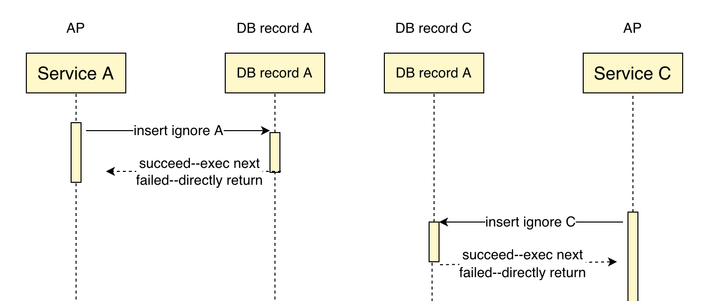

# Exceptions and subtransaction barriers

Distributed transactions are difficult mainly because various unintended situations can occur at various nodes in a distributed system. This article first introduces the exception problems in distributed systems, then describes the challenges these problems bring to distributed transactions, and next points out the problems with various existing common usages, and finally gives the right solution.

## The NPC Challenge
Probably the biggest enemy of distributed systems is NPC, which in this case is an acronym for Network Delay, Process Pause, Clock Drift. Let's look at what the specific NPC issues are.

- Network Delay: While the network works fine in most cases, and while TCP guarantees that transfers are sequential and not lost, it cannot eliminate the network delay problem.
- Process Pause: There are many reasons for process pauses: for example, the GC (garbage collection mechanism) in programming languages suspends all running threads; for example, we sometimes suspend cloud servers so that we can migrate them from one host to another without rebooting. There is no way to predict with certainty the length of a process pause; you would think that a few hundred milliseconds would be a long time, but in reality it is not uncommon for processes to pause for several minutes.
- Clock Drift: In real life we usually think of time as passing smoothly and monotonically increasing, but not in computers. Computers use clock hardware to keep time, usually quartz clocks, which have limited accuracy and are affected by the temperature of the machine. In order to synchronize the time between multiple machines on a network to some extent, the NTP protocol is often used to align the local device's time with a dedicated time server. A direct result of this is that the device's local time may suddenly jump forward or backward.

Cross-database distributed transactions, since they are distributed systems, naturally have NPC problems as well. Since there are no timestamps involved, the nuisance posed is mainly NP.

## Exception classification

Let's take TCC distributed transactions as an example to see the impact brought by NP.

In general, the execution order of a TCC rollback is that the Try is executed first and then the Cancel is executed, but because of N, it is possible that the network latency of the Try is long, resulting in the execution of the Cancel first and then the Try.

This situation introduces two difficulties in distributed transactions.
- **Null compensation:** When Cancel is executed, Try has not been executed, and the Cancel operation of the transaction branch needs to determine that Try is not executed, which requires ignoring the business data updates in Cancel and returning directly
- **Suspension:** When Try is executed after Cancel being executed, the Try operation of the transaction branch needs to determine that Cancel has been executed, then it should ignore the business data updates in Try and return directly

Distributed transactions have another class of common problems that need to be dealt with, which is duplicate requests
- **Idempotency:** Since any request can have network exceptions and duplicate requests, all distributed transaction branch operations need to ensure idempotency

Because null compensation, suspension, and duplicate requests are all related to NP, we refer to them collectively as the sub-transaction disorder problem. In business processing, these three problems need to be handled carefully, otherwise data inconsistency will appear.

## Causes of Exceptions

See a timing diagram of network exceptions below to better understand the above kinds of problems


- When the business processes request 4, Cancel is executed before Try and needs to handle null compensation
- When business processing request 6, Cancel is executed repeatedly and needs to be idempotent
- When business processing request 8, Try is executed after Cancel and needs to handle suspension

## Problems with existing solutions
For open source projects other than dtm, including the various cloud vendors, they give most of the business implementation proposals similar to the following.

- **Null compensation:** "For this problem, in the service design, you need to allow null compensation, that is, when no business primary key to be compensated is found, the compensation success is returned and the original business primary key is recorded, marking the business flow has been compensated successfully."
- **Anti-suspension:** "Need to check whether the current business primary key already exists in the business primary key recorded down by the empty compensation, and if so, refuse to execute the service to avoid data inconsistency."

The above implementation can work normally in most cases, but the above practice of "check first, change later" is easy to fall into the pit in the case of concurrency, let's analyze the following scenario.

- When Try is executed, after checking the business primary key without empty compensation records, the process pauses, resulting in a long wait for the local transaction before commiting.
- After the global transaction timeout, Cancel is executed, because the business primary key to be compensated is not committed, so it is considered to be null compensation and returns
- Try's process endup it's pause and finally commits the local transaction
- After the global transaction rollback is completed, the business operation of the Try branch is not rolled back and a data inconsistency is generated

In fact, there are many kinds of scenarios of P and C in NPC, and combinations of P and C, which can lead to the above competing situations, so I will not go into them one by one.

Although this scenario is not frequent, in the financial field, once money accounts are involved, then the impact can be huge.

PS: In repeated request handling, "first check then change", is also very easy to have similar problems. The key point to solve this kind of problem is to use "change instead of check" to avoid competing conditions.

## Subtransaction barriers

We pioneered the sub-transaction barrier technology in dtm. Using this technology, it is very easy to solve exception problems and greatly reduces the threshold of using distributed transactions.

The subtransaction barrier can achieve the following effect, see the figure.


All these requests, when they reach the sub-transaction barrier: abnormal requests, are filtered; normal requests, pass the barrier. After the developer uses the sub-transaction barrier, all the various exceptions described earlier are handled properly, and the business developer only needs to focus on the actual business logic.

Sub-transaction barriers provide the method BranchBarrier.CallWithDB , the prototype of the method is

``` go
func (bb *BranchBarrier) CallWithDB(db *sql.DB, busiCall BusiFunc) error
```

Business developers, writing their own logic inside busiCall, call BranchBarrier.CallWithDB . BranchBarrier.CallWithDB guarantees that busiCall will not be called in scenarios such as null compensation, suspension, etc., and that there is idempotency control to ensure that it is committed only once when the business is called repeatedly.

Sub-transaction barriers will manage TCC, SAGA, transaction messages, etc., and can also be extended to other areas

## Principle

The principle of subtransaction barrier technology is to create a branch operation status table dtm_barrier in the local database, with the unique key of gid-branch_id-branch_op

1. open the local transaction
2. for the current operation op (try|confirm|cancel), insert ignore a row gid-branchid-[op], if the insertion is unsuccessful, commit the transaction returns success (common idempotency control method)
3. if the current operation is cancel, then in insert ignore a row gid-branchid-try, if the insertion is successful (note that it is successful), then commit the transaction and returns success
4. call the business logic within the barrier, if the business returns success, the transaction is committed to return success; if the business returns failure, the transaction is rollbacked and returns failure

Under this mechanism, solves the problems related to sub-transaction dis-order

- null compensation control - if Cancel is executed before Try, then Cancel in 3 will succeed in inserting gid-branchid-try and not execute the logic inside the barrier
- idempotency control - any operation in 2 can not repeat the insertion of a unique key, ensuring that it will not be repeatedly executed
- anti-suspension control - if Try is executed after Cancel, then Cancel will insert gid-branchid-try in 3, causing Try to not execute the logic inside the barrier because insertion does not succeed in 2.

For SAGA, two-stage messages, a similar mechanism is used.

## Schematic diagram (optional reading)
Below we detail the sub-transaction barrier in a diagrammatic way. Since the Confirm operation is not involve in null compensation and suspension, so we only focus on Try and Cancel. In diagram, we use A to desinate Try, C to desinate Cancel.

The corresponding idempotent processing part of the subtransaction barrier.



This part is the regular idempotent processing part, inserting a unique key into the database, and if it is a duplicate request, then the insertion fails and a direct success is returned.

The sub-transaction barrier technique is to add only one step to the above idempotent processing part. For operation C, insert ignore a record A. Under normal flow, A is inserted unsuccessfully, and then proceeds to the next step.



When disorder occurs, assuming that C is executed before A, as the following timing diagram shows.



- For operation C, it is executed before A and is a null compensation; At this point, when operation C inserts A record, it finds that the insertion is successful and returns directly
- For A operation, it is executed after C, so a suspention occur; At this point operation A inserted A record, and found that the insertion failed, and directly returned

Both cases will be returned by the sub-transaction barrier interception without executing the internal business operations. You can see that the sub-transaction barrier very cleverly solves the three problems of idempotency, null compensation and suspension.

## Competitive Analysis
The above analysis solves the null compensation and hanging problems if the execution times of Try and Cancel do not overlap. Let's see what happens if there is a situation where the execution times of Try and Cancel overlap.

Suppose Try and Cancel are executed concurrently, and both Cancel and Try insert the same record gid-branchid-try. Due to the unique index conflict, only one of the two operations can succeed, while the other one will wait for the transaction holding the lock to complete and return.

- Case 1, Insertion of gid-branchid-try in Try failed, and Insertion of gid-branchid-try in Cancel succeed: This is a typical null compensation and hanging scenario, according to the sub-transaction barrier algorithm, Try and Cancel will return directly without doing business.
- Case 2, Insertion of gid-branchid-try in Try succeed, and Insertion of gid-branchid-try in Cancel failed: According to the above sub-transaction barrier algorithm, business are done normally, first Try then Cancel.
- Case 3, Try and Cancel operations during the overlap and encounter downtime, then at least Cancel will be retried by dtm, then eventually will go to case 1 or 2.

The sub-transaction barrier can guarantee the correctness of the final result in various NP cases.

## Advantages

In fact, sub-transaction barriers have a large number of advantages, including:
- Two insert judgments solve the three problems of null compensation, anti-suspension, and idempotency, which significantly reduce the logic complexity compared to other solutions which judges each of the three cases separately
- DTM's sub-transaction barrier solve these three problems in SDK, the business does not need to care at all
- High performance: Only one insertion for normally completed transactions (generally no more than 1% of transactions fail). The additional overhead of the subtransaction barrier is one SQL per branch operation, which is less costly than other solutions.

## Supported Storage
Currently sub-transaction barriers have supported:
- Databases: including Mysql, Postgres, and databases compatible with Mysql, Postgres
- Cache Redis: using Lua script transaction support
- Mongo: using Mongo's transaction support

With sub-transaction barrier support, you can combine Redis, Mongo, and database transactions to form a global transaction. Related usage can be found inside [dtm-examples](https://github.com/dtm-labs/dtm-examples)

Theoretically, various stores that support transactions can easily implement subtransaction barriers, such as TiKV, etc. If users have such a need, we will quickly support it.

## Interfacing with orm library

Barrier provides sql standard interface, but applications usually introduces more advanced orm library instead of bare sql interface. If you want to introduce sub-transaction barriers to you applications together with orm, please see [Work with ORM](../ref/sdk#db)

## Summary

The subtransaction barrier technique, pioneered by DTM, is significant because

- Simple algorithm and easy to implement
- A unified system solution, easy to maintain
- Easy-to-use interface

With the help of this sub-transaction barrier technology, developers are completely freed from the handling of NPC.

This technology currently needs to be paired with DTM transaction manager, and the SDK is currently available to developers of Go, Java, Python, c#, and PHP languages. Other languages' sdk is under planning. For other distributed transaction frameworks, as long as the appropriate distributed transaction information is provided, the technology can also be quickly implemented according to the above principles.
