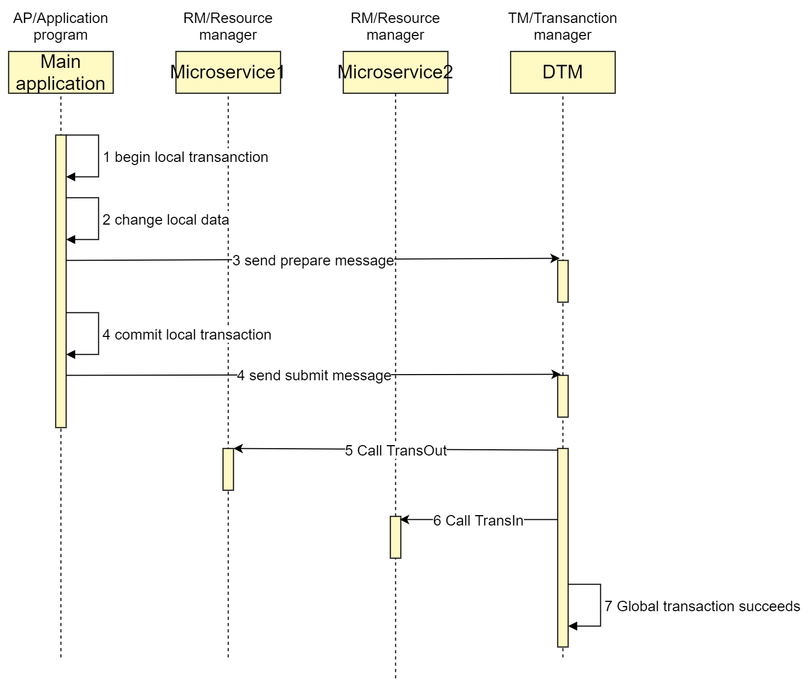
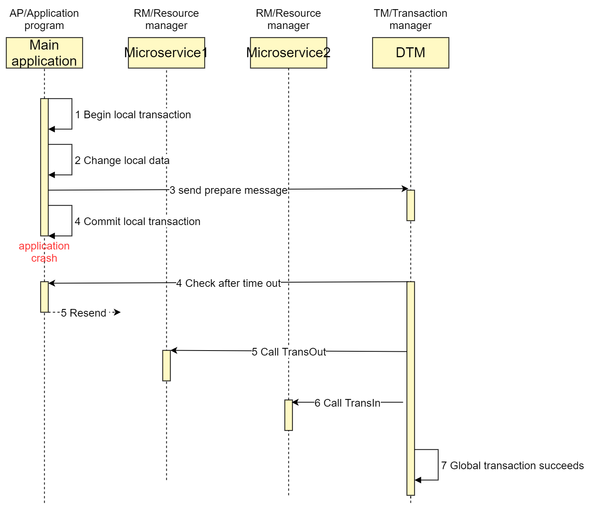

# Transactional Messaging

Transactional Messaging provides a transaction-enabled messaging interface, with which applications can send messages within the context of a local transaction to guarantee the atomicity of the global transaction.
It works as follows:

Local application

- Open a local transaction
- Make changes to the local database
- Call the Prepare interface of Transactional Messaging to send the prepare message to the transaction manager
- Commit the local transaction
- Call the Submit interface of Transactional Messaging to send the submit message to the transaction manager

When the transaction manager receives only a prepare message but no subsequent submit message within the time frame, it calls the canSubmit Check interface of Transactional Messaging which asks the application if the global transaction can be committed.

Transactional Messaging is similar to the local messaging solution.
The difference is that the operations of creating and polling the local message table are replaced with a Check interface which is easier to use.

Suppose a scenario where a coupon and a membership of one-month are given to a user after successful registration. 
Since the coupon and one-month membership must not fail, this scenario is perfect for the reliable Transaction Messaging model.

## Successful transactional message

Let's take an inter-bank transfer as an example. 
The timing diagram for a successful transactional message within the context of distributed transaction is shown as follows:



Let's complete this distributed transaction using transactional message in DTM:

### http
[examples/http_msg](https://github.com/yedf/dtm/blob/main/examples/http_msg.go):

``` go
	logrus.Printf("a busi transaction begin")
	req := &TransReq{Amount: 30}
	msg := dtmcli.NewMsg(DtmServer, dtmcli.MustGenGid(DtmServer)).
		Add(Busi+"/TransOut", req).
		Add(Busi+"/TransIn", req)
	err := msg.Prepare(Busi + "/CanSubmit")
	e2p(err)
	logrus.Printf("busi trans submit")
	err = msg.Submit()
```

### grpc

[examples/grpc_msg](https://github.com/yedf/dtm/blob/main/examples/grpc_msg.go)：

``` go
	req := dtmcli.MustMarshal(&TransReq{Amount: 30})
	gid := dtmgrpc.MustGenGid(DtmGrpcServer)
	msg := dtmgrpc.NewMsgGrpc(DtmGrpcServer, gid).
		Add(BusiGrpc+"/examples.Busi/TransOut", req).
		Add(BusiGrpc+"/examples.Busi/TransIn", req)
	err := msg.Submit()
```

In the above code, a transactional message is created first.
Two subtransactions, namely TransOut and TransIn, are added to the transactional message.
The local transaction internally calls the Prepare interface.
After the local transaction is committed, it calls the Submit interface. 
After DTM receives the submit message, it calls the relevant subtransaction to ensure final completion.

## Timeout check

If the application crashes after it calls Prepare but before it can call Submit, DTM will call the Check interface.
The timing diagram for a successful check is as follows:


