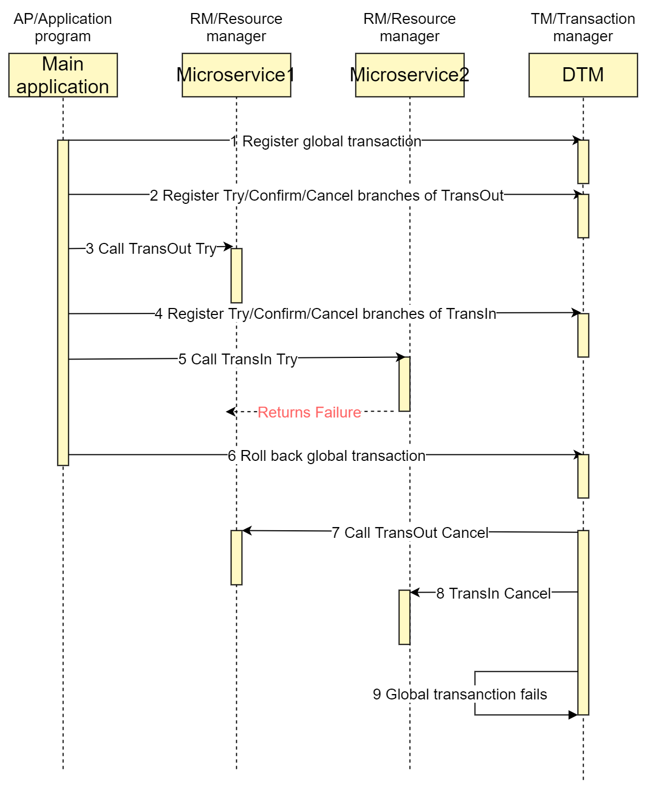
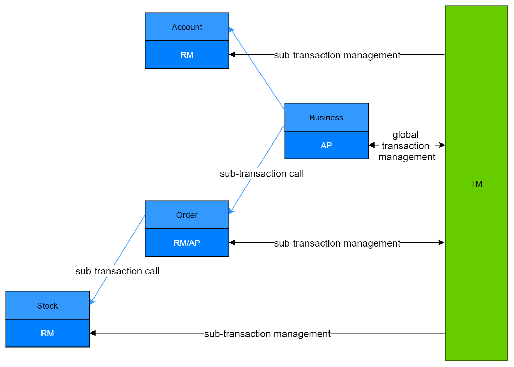

# TCC

TCC is an acronym for Try, Confirm, Cancel, and was first proposed by Pat Helland in 2007 in the paper called "Life beyond Distributed Transactions: an Apostate's Opinion".

## Workflow

TCC is divided into 3 phases

- Try phase: The requestor requests the service provider to perform a tentative operation.
  The provider shall complete all business validations (consistency), and reserve required business resources (quasi-isolation).

- Confirm phase: If the provider completes the Try phase successfully, the requestor can execute a confirmation operation on the provider if it decides to move forward.
  The Confirm phase is where the business is actually conducted.
  No more business validations will be performed, and only those business resources reserved in the Try phase will be used.

- Cancel phase: The requestor can execute a cancellation operation on the provider if it decides not to move forward, e.g., when the provider does not complete the Try phase successfully.
  Business resources reserved in the Try phase should be released in the Cancel phase.

Suppose we want to perform an inter-bank transfer, using TransOut and TransIn implemented in separate micro-services.
A typical timing diagram for a successfully completed transaction using the TCC transaction model is as follows:


## Simple TCC

Let's complete one of the simplest TCC:

### http
``` go
err := dtmcli.TccGlobalTransaction(DtmServer, gid, func(tcc *dtmcli.Tcc) (*resty.Response, error) {
  resp, err := tcc.CallBranch(&TransReq{Amount: 30}, Busi+"/TransOut", Busi+"/TransOutConfirm", Busi+"/TransOutRevert")
  if err != nil {
    return resp, err
  }
  return tcc.CallBranch(&TransReq{Amount: 30}, Busi+"/TransIn", Busi+"/TransInConfirm", Busi+"/TransInRevert")
})
```

### grpc
``` go
gid := dtmgrpc.MustGenGid(DtmGrpcServer)
err := dtmgrpc.TccGlobalTransaction(DtmGrpcServer, gid, func(tcc *dtmgrpc.TccGrpc) error {
  data := dtmcli.MustMarshal(&TransReq{Amount: 30})
  _, err := tcc.CallBranch(data, BusiGrpc+"/examples.Busi/TransOut", BusiGrpc+"/examples.Busi/TransOutConfirm", BusiGrpc+"/examples.Busi/TransOutRevert")
  if err != nil {
    return err
  }
  _, err = tcc.CallBranch(data, BusiGrpc+"/examples.Busi/TransIn", BusiGrpc+"/examples.Busi/TransInConfirm", BusiGrpc+"/examples.Busi/TransInRevert")
  return err
})
```

The call to TccGlobalTransaction opens a global transaction using the TCC transaction model.
The function signature is as follows:

``` go
// TccGlobalTransaction begin a tcc global transaction
// dtm dtm server address
// gid global transaction id
// tccFunc the function representing the global transaction using the TCC transaction model. The TCC workflow(s) can be invoked in tccFunc.
func TccGlobalTransaction(dtm string, gid string, tccFunc TccGlobalFunc) error
```

When the global transaction starts, the content of function tccFunc will be called.
In the example, inside function tccFunc, we call CallBranch twice to define two sub-transactions TransOut and TransIn, each built using the TCC transaction model.

``` go
// CallBranch call a tcc branch
// It first registers functions for the Try, Confirm, and Cancel phases. If the registration is successful, the function for the Try phase is called, and the result is returned.
func (t *Tcc) CallBranch(body interface{}, tryURL string, confirmURL string, cancelURL string) (*resty.Response, error)
```

When tccFunc returns normally, TccGlobalTransaction commits the global transaction that contains all TCC workflows, and returns to the caller.
DTM receives the request to commit, and calls the functions for the Confirm phase that are registered for all TCC workflows.
When tccGlobalTransaction returns, all functions for the Try phase have completed, but those for the Confirm phase are usually not yet completed.

### Rollback upon failure

If tccFunc returns an error, TccGlobalTransaction terminates the global transaction and returns to the caller.
DTM receives the request to terminate, and calls the functions for the Cancel phase that are registered for all TCC workflows.

Let's purposely fail the second TCC workflow in the global transaction by passing the argument and watch what happens.

``` go
res2, rerr := tcc.CallBranch(&TransReq{Amount: 30, TransInResult: "FAILURE"}, Busi+"/TransIn", Busi+"/TransInConfirm", Busi+"/TransInRevert")
```

The timing diagram for failure is as follows:



## Confirm/Cancel failure

What happens if a Confirm/Cancel operation fails? According to the protocol of Tcc mode, Confirm/Cancel operation is not allowed to fail, and any failure is due to temporary failure or program bugs. dtm will keep retrying until success when Confirm/Cancel operation fails.

In order to avoid program bugs that cause compensation operations to fail all the time, it is recommended that developers monitor the global transaction table, find out transactions with more than 3 retries, issue alarms, and push developers to handle them manually, see [dtm's O&M](...) /deploy/maintain)

## Design Principles
By design, TCC is mainly used to handle short transactions with high consistency requirements.

#### How TCC can achieve better consistency
For our scenario of A inter-bank transfer to B, if we use SAGA, adjust the balance in the forward operation, and in the compensation operation, adjust the balance in the reverse, then this will happen: if A debits successfully, but the amount transfer to B fails, and finally rolls back and adjusts A's balance to the initial value. The whole process can be very disturbing to A if A finds that its balance has been deducted, but the recipient B does not receive the funds.

The above requirement cannot be solved in SAGA, but it can be solved by TCC with the following design technique.
- Introduce a trading_balance field in addition to the balance field in the account
- Try phase: to check if the account is frozen, check if the account balance is sufficient, and then adjust the trading_balance (i.e., the frozen funds for business purposes)
- Confirm phase: adjust balance, adjust trading_balance (i.e. unfrozen funds for business)
- Cancel phase: adjust trading_balance (i.e., unfrozen funds on the business)

In this case, if end-user A's balance is deducted, B will always receive the funds later.

### Why only for short transactions

TCC's transaction orchestration is placed on the application side, including, how many branches the transaction contains in total, what is the order of each branch. These information will not be sent to the dtm server as in SAGA. When the application crashes or quits and the orchestration information is lost, there is no way to retry the whole global transaction forward, only to roll back. If the global transaction takes a long time, say a minute or more, then when the application does a normal release upgrade, it will also cause the global transaction to roll back and affect the business. Therefore TCC would be more suitable for short transactions.

So is it possible to save all the transaction orchestration of TCC to the server to ensure that the application is not affected even if it is restarted? Theoretically this approach can solve this problem, but storing to the server will be more inflexible than on the application side, unable to get to the intermediate results of each branch, unable to do nesting, etc..

Considering that higher consistency requirements and short transactions are highly correlated (a transaction with a long duration of inconsistency will not be considered consistent), and that these two are also highly correlated with "flexible application orchestration", TCC is implemented as application-side orchestration, and SAGA is implemented as server-side orchestration.

## Nested TCC

The TCC transaction model of dtm supports nested subtransactions, with the following flowchart.



In this flowchart, Order, a microservice, manages the order-related data modifications and also manages a nested subtransaction, so it plays the role of RM and AP.

#### Example

tcc supports nested subtransactions with the following code (refer to [dtm-examples](https://github.com/dtm-labs/dtm-examples) for the source code).

``` go
err := dtmcli.TccGlobalTransaction(DtmServer, gid, func(tcc *dtmcli.Tcc) (*resty.Response, error) {
  resp, err := tcc.CallBranch(&TransReq{Amount: 30}, Busi+"/TransOut", Busi+"/TransOutConfirm", Busi+"/TransOutRevert")
  if err ! = nil {
    return resp, err
  }
  return tcc.CallBranch(&TransReq{Amount: 30}, Busi+"/TransInTccParent", Busi+"/TransInConfirm", Busi+"/TransInRevert")
})
```

Here the TransInTccParent subtransaction, which will then call the TransIn subtransaction, has the following code.

``` go
app.POST(BusiAPI+"/TransInTccParent", common.WrapHandler2(func(c *gin.Context) interface{} {
  tcc, err := dtmcli.TccFromReq(c)
  if err ! = nil {
    return err
  }
  logrus.Printf("TransInTccParent")
  return tcc.CallBranch(&TransReq{Amount: reqFrom(c).Amount}, Busi+"/TransIn", Busi+"/TransInConfirm", Busi+"/TransInRevert")
}))
```

When subtransactions are nested, the tcc object is constructed from the incoming request, and then you will be able to use the tcc object normally for the transaction in question.

## Summary

In this section of the tutorial, we have briefly introduced the TCC transaction model. After describing the theory of TCC, we gave an overall picture of how to write a global transaction using TCC with several examples, covering both normal successful completion and failure rollback scenarios.
Nested TCC is also demonstrated.

A complete example about TCC transactions with detailed business can be found at [TCC Tutorial](https://segmentfault.com/a/1190000040331793/en)
